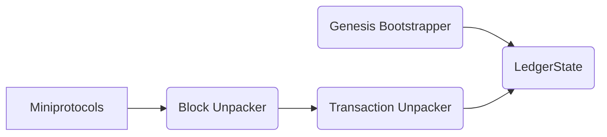

# Acropolis

Acropolis is a project to create a kit of micro-service parts, written in
Rust, which allows flexible construction of clients, services and APIs for
the Cardano ecosystem.

Acropolis is based on the
[Caryatid framework](https://github.com/input-output-hk/caryatid),
which in turn uses a message bus such as [RabbitMQ](https://www.rabbitmq.com/)
to communicate between micro-services.

## Modules

This project is in an experimental phase at the moment, and the modules
are very basic and naive:

* [Mini-protocols](modules/miniprotocols) - implementation of the
  Node-to-Node (N2N) client-side (initiator) protocol, allowing chain
  synchronisation and block fetching
* [Genesis Bootstrapper](modules/genesis_bootstrapper) - reads the Genesis
  file for a chain and generates initial UTXOs
* [Block Unpacker](modules/block_unpacker) - unpacks received blocks
  into individual transactions
* [Tx Unpacker](modules/tx_unpacker) - parses transactions and generates UTXO
  changes
* [Ledger State](modules/ledger_state) - watches UTXO changes and maintains a basic in-memory ledger state

## Messages

The messages passed between modules are defined in a single global enum in
the [Messages](messages) crate.

## Processes

There is currently only one process, for testing:

* [Omnibus](processes/omnibus) - includes all the above modules for
  testing, by default using the external message bus to allow
  diagnostics

