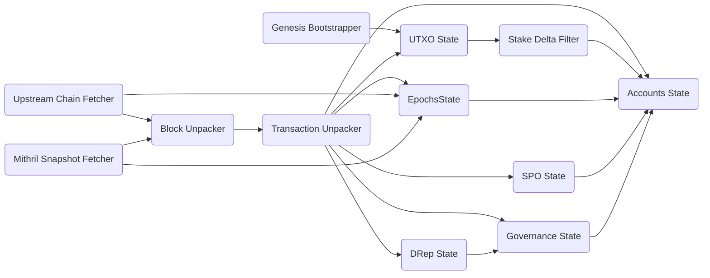

# Acropolis

Acropolis is a project to create a kit of micro-service parts, written in
Rust, which allows flexible construction of clients, services and APIs for
the Cardano ecosystem.

Acropolis is based on the
[Caryatid framework](https://github.com/input-output-hk/caryatid),
which in turn uses a message bus such as [RabbitMQ](https://www.rabbitmq.com/)
to communicate between micro-services.

## Modules

This project is in an experimental phase at the moment, and the module
structure is highly subject to change:

* [Upstream Chain Fetcher](modules/upstream_chain_fetcher) -
  implementation of the Node-to-Node (N2N) client-side (initiator)
  protocol, allowing chain synchronisation and block fetching
* [Mithril Snapshot Fetcher](modules/mithril_snapshot_fetcher) -
  Fetches a chain snapshot from Mithril and replays all the blocks in it
* [Genesis Bootstrapper](modules/genesis_bootstrapper) - reads the Genesis
  file for a chain and generates initial UTXOs
* [Block Unpacker](modules/block_unpacker) - unpacks received blocks
  into individual transactions
* [Tx Unpacker](modules/tx_unpacker) - parses transactions and generates UTXO
  changes
* [UTXO State](modules/utxo_state) - watches UTXO changes and maintains a basic in-memory UTXO state
* [SPO State](modules/spo_state) - matches SPO registrations and retirements
* [DRep State](modules/drep_state) - tracks DRep registrations
* [Governance State](modules/governance_state) - tracks Governance Actions and voting
* [Stake Delta Filter](modules/stake_delta_filter) - filters out stake address changes and handles stake pointer references
* [Epochs State](modules/epochs_state) - track fees blocks minted and epochs history
* [Accounts State](modules/accounts_state) - stake and reward accounts tracker

## Messages

The messages passed between modules are defined in a single global enum in
the [Messages](messages) crate.

## Processes

There is currently only one process, for testing:

* [Omnibus](processes/omnibus) - includes all the above modules for
  testing, by default using the internal message bus only

