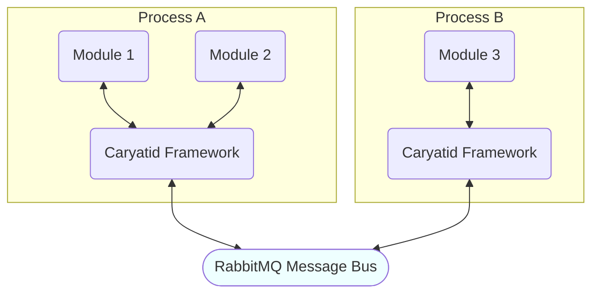

# Acropolis

Acropolis is a project to create a kit of modular parts, written in
Rust, which allows flexible construction of clients, services and APIs for
the Cardano ecosystem.

## Status

This project has moved out of the experimental phase and is being implemented
according to a set of deliverables documented in the Treasury Fund Milestones.

# Overview and Deliverables

The Acropolis Cardano Node is a rust implementation that seeks parity with the
Haskell implementation and is intended to be a full block producing node on mainnet.
Please see the [overview document](docs/overview.md) that describes the phases of
development, descriptions, expected use cases, and runtime environments expected
of each of the deliverables.

# Architecture

Acropolis is based on the
[Caryatid framework](https://github.com/input-output-hk/caryatid),
which in turn uses a message bus such as [RabbitMQ](https://www.rabbitmq.com/)
to communicate between micro-services.

## Modules

- [Peer Network Interface](modules/peer_network_interface) -
  implementation of the Node-to-Node (N2N) client-side (initiator)
  protocol, allowing chain synchronisation and block fetching
- [Mithril Snapshot Fetcher](modules/mithril_snapshot_fetcher) -
  Fetches a chain snapshot from Mithril and replays all the blocks in it
- [Genesis Bootstrapper](modules/genesis_bootstrapper) - reads the Genesis
  file for a chain and generates initial UTXOs
- [Snapshot Bootstrapper](modules/snapshot_bootstrapper) - downloads ledger state snapshot files for configured epochs,
  streams and parses the CBOR data (UTXOs, pools, accounts, DReps, proposals), and publishes completion messages to
  signal snapshot readiness to other modules.
- [Block Unpacker](modules/block_unpacker) - unpacks received blocks
  into individual transactions
- [Tx Unpacker](modules/tx_unpacker) - parses transactions and generates UTXO
  changes
- [UTXO State](modules/utxo_state) - watches UTXO changes and maintains a basic in-memory UTXO state
- [SPO State](modules/spo_state) - matches SPO registrations and retirements
- [DRep State](modules/drep_state) - tracks DRep registrations
- [Governance State](modules/governance_state) - tracks Governance Actions and voting
- [Stake Delta Filter](modules/stake_delta_filter) - filters out stake address changes and handles stake pointer
  references
- [Epochs State](modules/epochs_state) - track fees blocks minted and epochs history
- [Accounts State](modules/accounts_state) - stake and reward accounts tracker
- [Assets State](modules/assets_state) - tracks native asset supply, metadata, transactions, and addresses

## Processes

There is currently only one process, for testing:

- [Omnibus](processes/omnibus) - includes all the above modules for
  testing, by default using the internal message bus only

## Build

Everything is locally contained or is a crate dependency. To build the node,

`make build`

## Running the node

The following will run the omnibus process.

`make run`
