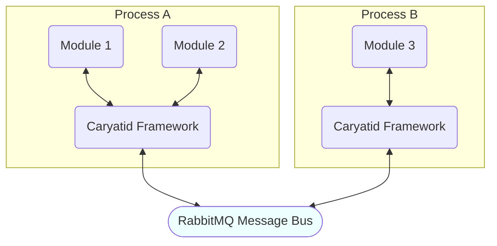

# Acropolis

Acropolis is a modular Rust implementation of a Cardano node, built using the
[Caryatid framework](https://github.com/input-output-hk/caryatid). It provides
a kit of modular parts for flexible construction of clients, services, and APIs
for the Cardano ecosystem. The project seeks parity with the Haskell Cardano
node implementation and is intended to be a full block-producing node on mainnet.

Please see the [overview document](docs/overview.md) for development phases,
deliverables, and expected use cases.

## Quick Start

**Prerequisites:** Rust 1.93+ (installed automatically via `rust-toolchain.toml`),
a C compiler, and on Linux: `pkg-config` and `libssl-dev`.
See the [Getting Started guide](docs/getting-started.md) for full details.

```sh
# Run on mainnet (genesis sync via Mithril)
make run

# Or run on the preview testnet
make run-preview

# Or bootstrap from a ledger state snapshot (faster)
make run-bootstrap
```

Set the log level with `make run LOG_LEVEL=debug` (options: `error`, `warn`, `info`, `debug`, `trace`).

### Docker

```sh
docker compose up omnibus-mainnet
```

See [Getting Started — Docker Compose](docs/getting-started.md#docker-compose) for all services and port mappings.

## Architecture

Acropolis uses a **publish-subscribe message-passing architecture**. Modules
communicate via messages on topics rather than direct function calls, providing
module isolation, easy replacement, and natural parallelism.

By default, modules run in a single process communicating over an in-memory
message bus (zero-copy Rust structs). Optionally, modules can run in separate
processes communicating via [RabbitMQ](https://www.rabbitmq.com/).


```mermaid
graph TB
  subgraph Process A
    Module1(Module 1)
    Module2(Module 2)
    Caryatid1(Caryatid Framework)
    Module1 <--> Caryatid1
    Module2 <--> Caryatid1
  end

  subgraph Process B
    Module3(Module 3)
    Caryatid2(Caryatid Framework)
    Module3 <--> Caryatid2

  end

  RabbitMQ([RabbitMQ Message Bus])
  style RabbitMQ fill: #eff
  Caryatid1 <--> RabbitMQ
  Caryatid2 <--> RabbitMQ
```

## Modules

### Bootstrapping
- [Genesis Bootstrapper](modules/genesis_bootstrapper) — reads the Genesis files for a network and initializes initial UTxOs and protocol parameters
- [Mithril Snapshot Fetcher](modules/mithril_snapshot_fetcher) — fetches a chain snapshot from Mithril and replays all blocks
- [Snapshot Bootstrapper](modules/snapshot_bootstrapper) — downloads and streams ledger state snapshots (UTXOs, pools, accounts, DReps, proposals)

### Network & Consensus
- [Peer Network Interface](modules/peer_network_interface) — Node-to-Node (N2N) client protocol for chain synchronisation and block fetching
- [Consensus](modules/consensus) — Ouroboros Praos consensus protocol

### Block & Transaction Processing
- [Block Unpacker](modules/block_unpacker) — unpacks received blocks into individual transactions
- [Tx Unpacker](modules/tx_unpacker) — parses transactions and generates UTXO changes
- [Block VRF Validator](modules/block_vrf_validator) — validates block VRF proofs
- [Block KES Validator](modules/block_kes_validator) — validates block KES signatures

### Ledger State
- [UTXO State](modules/utxo_state) — maintains in-memory UTXO state
- [SPO State](modules/spo_state) — tracks stake pool registrations and retirements
- [DRep State](modules/drep_state) — tracks DRep registrations
- [Accounts State](modules/accounts_state) — stake and reward accounts tracker
- [Epochs State](modules/epochs_state) — tracks fees, blocks minted, and epoch history
- [Parameters State](modules/parameters_state) — tracks protocol parameters and updates
- [Governance State](modules/governance_state) — tracks governance actions and voting

### Distribution Snapshots
- [SPDD State](modules/spdd_state) — stake pool delegation distribution snapshots
- [DRDD State](modules/drdd_state) — DRep delegation distribution snapshots
- [Stake Delta Filter](modules/stake_delta_filter) — filters stake address changes and resolves stake pointers

### API Persistent State
- [Assets State](modules/assets_state) — tracks native asset supply, metadata, transactions, and addresses
- [Address State](modules/address_state) — address-level transaction and balance tracking
- [Historical Accounts State](modules/historical_accounts_state) — historical account state (rewards, delegations, registrations)
- [Historical Epochs State](modules/historical_epochs_state) — historical epoch data

### Storage & Interfaces
- [Chain Store](modules/chain_store) — persistent block storage (Fjall LSM)
- [REST Blockfrost API](modules/rest_blockfrost) — Blockfrost-compatible REST API
- [MCP Server](modules/mcp_server) — Model Context Protocol server
- [TX Submitter](modules/tx_submitter) — transaction submission
- [Custom Indexer](modules/custom_indexer) — user-defined indexing
- [Stats](modules/stats) — runtime statistics

## Processes

Processes are executable binaries that bundle modules together:

- [Omnibus](processes/omnibus) — all-inclusive testing process containing all modules (in-memory message bus)
- [Replayer](processes/replayer) — replay previously downloaded messages from JSON files
- [Golden Tests](processes/golden_tests) — end-to-end golden test execution
- [TX Submitter CLI](processes/tx_submitter_cli) — command-line wrapper for transaction submission
- [Midnight Indexer](processes/midnight_indexer) — Midnight-specific block indexing

## Documentation

| Document | Description |
|----------|-------------|
| [Getting Started](docs/getting-started.md) | Prerequisites, build, run, configuration, Docker |
| [Configuration Reference](docs/configuration.md) | All module settings, defaults, and API feature flags |
| [Overview & Deliverables](docs/overview.md) | Development phases and node deliverables |
| [Bootstrap Guide](docs/bootstrap.md) | Snapshot bootstrap architecture and quick start |
| [Architecture: Modularity](docs/architecture/modularity.md) | Pub-sub design and module communication |
| [Epoch Timing](docs/epoch-timing.md) | Epoch boundaries, rewards, and snapshot rotation |
| [Memory Profiling](docs/memory-profiling.md) | Heap profiling with jemalloc |
| [Performance Profiling](docs/performance-profiling.md) | CPU profiling with Linux perf |
| [API Specification](API/openapi.yaml) | Blockfrost-compatible REST API (OpenAPI) |
| [Modules Reference](modules/README.md) | All modules with descriptions |
| [Processes Reference](processes/README.md) | Available process binaries |

## License

See [LICENSE](LICENSE).
