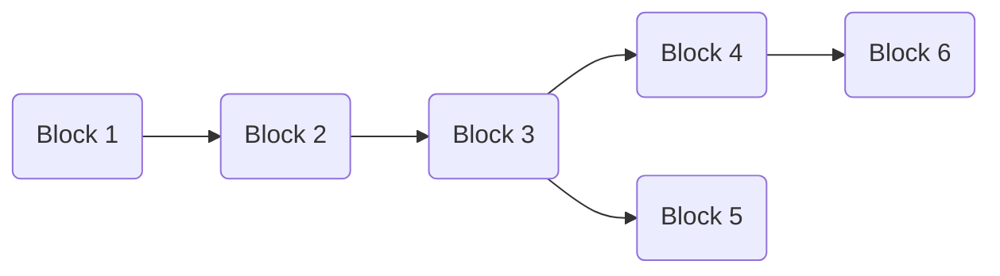

# Consensus Tree data structure

This is an outline of the consensus tree data structure used to track the current state of the
chain and all potentially viable forks. It is guide the implementation, not necessarily to be
replicated 1:1 in the code. As such this document will change and evolve.

## Data structure

ConsensusTree stores blocks in a rooted tree (a special case of a DAG). In this model, each block
has exactly one parent, so the structure is not a general DAG with shared-parent/merge nodes.
Even if two blocks carry similar payloads, different parent links produce different hashes and
therefore distinct nodes.

Only 'volatile' blocks (those within 'k' blocks of the current longest chain tip) are stored.



Blocks should be identified by hash.

The content of each Block comprises:

* The block number (height)
* The slot number
* The raw block body (`Option<Vec<u8>>` - None if not yet fetched)
* Hash of child blocks (`Vec<BlockHash>`)
* Hash of parent block (`Option<BlockHash>`) - the genesis root has none
* Lifecycle status (Offered → Wanted → Fetched → Validated, or Rejected)

These are stored in a `HashMap<BlockHash, TreeBlock>` for fast lookup by hash.

The tree also tracks a `root` hash, a `favoured_tip` hash, and the
security parameter `k`.

## Observers

The ConsensusTree will need observers/callbacks for:

* `block_proposed`: Block proposed as new tip of favoured chain (connects to `cardano.block.proposed`)
* `rollback`: Favoured chain has switched - indicates rollback to the common ancestor block number
* `block_rejected`: A block has failed validation - PNI should sanction the peers that provided it

## Operations

### Check if a block is wanted

`check_block_wanted(hash: BlockHash, parent_hash: BlockHash, number: u64, slot: u64) -> Result<Vec<BlockHash>>`

Queried when the Peer Network Interface (PNI) has offered a new block.  Returns a list of blocks
that are now wanted, which may include both the one offered and any previously unfetched blocks
on the now favoured chain.

Operation: Find the parent block by hash in the hashmap.  If the
block's number is not one more than the parent's block number, reject
(return error)

Create an empty result vector.

Create a new block (with no block_body) and add the block to the tree by connecting to the
parent and adding it to the parent's children.  Check fork depth against bounded `maxvalid`:
if fork depth > k, remove the block and reject.  Call `get_favoured_chain()`.

If the favoured chain has switched, call `find_common_ancestor`
with the old and new favoured tips, and call the `rollback` observer with the resulting common
ancestor number.

If the new block is the favoured chain tip, add its hash to the result vector, and walk down
the chain from the common ancestor to the new tip.  For each block:

* If it is already fetched, call the `block_proposed` observer with it
* If not, add it to the result vector.

(it may be easier to recurse back up the chain from the tip and do this operation on exit from
each recursion)

The effect of this is to publish blocks on the new chain that we have, and request those
we don't, which will then be fixed up in `add_block()` when they arrive.

Note: pruning is done externally by the consensus module, not inside this operation.

### Add a block:

`add_block(hash: BlockHash, body: Vec<u8>) -> Result<()>`

Called when PNI sends a block on `cardano.block.available`.  The hash is passed by the
caller (the consensus module knows which block body this is).

Operation: Look up the block by hash in the hashmap.  If it's not there, fail (we shouldn't
be sent blocks we haven't requested).

If this block was already fetched, exit.

Set the block_body of this block in the tree.

Call `get_favoured_chain` to get the favoured chain tip.

If all previous blocks from this block back to the root are fetched,
we are the next in order to be proposed, so call `block_proposed` with
this one, and any subsequent children which are on the favoured chain
(using `chain_contains()` with the favoured tip) which are also
fetched, stopping at any unfetched ones.

Note this is an event triggered fixup operation - each time a block arrives, we
propose as far down the chain as we can to retain the ordering.

### Remove a block

`remove_block(hash: BlockHash) -> Result<Vec<BlockHash>>`

Called when PNI sends `cardano.block.rescinded` because all peers have rolled back this block.
Returns a list of block hashes that have become wanted if the deletion of the block has changed the
favoured chain.

Find the block in the hash map, and remove it and all child blocks from the chain.

Process the potential favoured chain switch in the same way as `check_block_wanted()` (likely
common code), so that we generate a list of blocks that were previously unfetched but we now
need as part of the favoured chain, and propose any we have already fetched.

### Validation

`mark_validated(hash)` transitions a fetched block to Validated.

`mark_rejected(hash)` fires the `block_rejected` observer, then delegates to `remove_block`
to remove the block and its descendants (potentially triggering a chain switch).

## Helper functions

### Get favoured chain

`get_favoured_chain() -> Option<BlockHash>`

Recursively search the tree from the root to find the longest chain, and return the
last block on the longest chain.  Ties are broken deterministically in favour of the
chain containing the current `favoured_tip` (Praos `maxvalid` rule, paper line 667-668).
Uses an internal recursive function along these lines:

```rust
longest_chain_from(hash: BlockHash) -> (u64, BlockHash) {
let mut max_length = 0;
let mut best_tip = hash;

for child in block.children {
let (child_len, child_tip) = longest_chain_from(child);
if child_len > max_length {
max_length = child_len;
best_tip = child_tip;
} else if child_len == max_length {
// Tie-break: favour current tip (Praos maxvalid)
if child_tip == favoured_tip || is_ancestor_of(child_tip, favoured_tip) {
best_tip = child_tip;
}
}
}

(max_length + 1, best_tip)
}
```

### Find common ancestor

`find_common_ancestor(a: BlockHash, b: BlockHash) -> Result<BlockHash>`

Walk the higher-numbered block back until both are at the same height, then walk both
back in lockstep until they meet.  Returns an error if either block is not in the tree.

### Chain contains

`chain_contains(block_hash: BlockHash, tip: BlockHash) -> bool`

Returns whether a chain ending at the given tip includes the given block.  Walk back up
from the tip until you reach either the block (true) or there is no further to walk (false)

### Prune

`prune() -> Result<()>`

Discard all blocks from the tree older than `tip - k` where
'k' is the security parameter (a configuration option on the tree, currently 2160).  Derives
the prune boundary and favoured tip internally.  The block at the prune boundary on the
favoured chain becomes the new root.  All blocks reachable from the new root are preserved
(including forks after the boundary); everything else is discarded.

