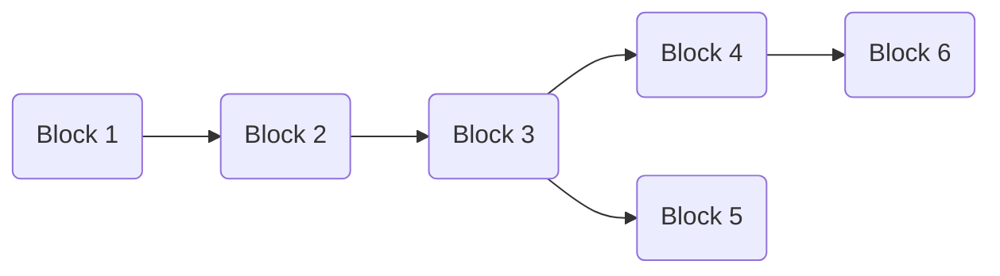

# Consensus Tree data structure

This is an outline of the consensus tree data structure used to track the current state of the
chain and all potentially viable forks.

## Data structure

The ConsensusTree will store blocks in a tree structure.  It is not a DAG because a block, even
with the same content as another, in a different part of the tree has different parents and hence
a different hash.

Only 'volatile' blocks (those within 'k' blocks of the current longest chain tip) are stored.



Blocks should be identified by hash.

The content of each Block comprises:

* The block number (height)
* The raw block body (optional CBOR bytes - None if not yet fetched)
* Pointers to child blocks (Vec<Arc<Block>>)
* Pointer to parent block (Option<Arc<Block>>) - the genesis root has none

These should be stored in a HashMap<Hash, Arc<Block>> for fast lookup by hash.

For the `get_favoured_chain()` operation we will probably need a
root_hash indicating the root of the tree, or a direct Arc<Block>
pointer, although it can be obtained from any node by walking
backwards up the tree.

## Observers

The ConsensusTree will need observers/callbacks for:

* `block_proposed`: Block proposed as new tip of favoured chain (connects to cardano.block.proposed)
* `rollback`: Favoured chain has switched - indicates rollback to the common ancestor block number

## Operations

### Check if a block is wanted

`check_block_wanted(hash: Hash, parent_hash: Hash, number: u64) -> Result<bool>`

Queried when the Peer Network Interface (PNI) has offered a new block.

Find the parent block by hash in the hashmap.  If the block's number is not more than the
parent's block number, reject (return error)

Test-add the block to the tree and call `get_favoured_chain` (perhaps
an optional parameter to pretend it has been added, rather than
actually adding it).  If the new block is the favoured chain tip,
return Ok(true), otherwise Ok(false).

(Note: we don't want to fetch blocks that aren't (yet) favoured)

### Add a block:

`add_block(block_body: Vec<u8>) -> Result<()>`

Called when PNI sends a block on `cardano.block.available`.

Operation: On receipt of a new candidate block, decode it to get the hash, parent's hash and
block number.  Find the parent block in the hashmap.

If the block's number is not one more than the parent's block number, reject.

Call `get_favoured_chain()` to get the current favoured tip.

If the favoured chain has switched, call `find_common_ancestor`
with the old and new favoured tips, and call the `rollback` observer with the resulting common
ancestor number, then `block_proposed` on every fetched block (with block_body set) from the
common ancestor down the favoured chain, until you reach an unfetched one.

If there is already a record of this block's hash, attach the
block_body to that Block record, and if the block forms part of the favoured chain
(using `chain_contains()` with the current favoured tip), call the `block_proposed`
observer with this block and any child blocks which have block_body set which are
also part of the favoured chain - this is an event-triggered fixup operation.

Otherwise create a new block record, insert in hash map, add the block
to the parent's children and link the parent from the block.

If the new block is now the tip of the favoured chain (which must be
the case on a switch, but is the normal case anyway), call the
`block_proposed` observer.

Call `prune(block.number)` to remove any now-immutable blocks.

### Remove a block

`remove_block(hash: Hash) -> Result<()>`

Called when PNI sends `cardano.block.rescinded` because all peers have rolled back this block.

Find the block in the hash map, and remove it and all child blocks from the chain.

Call `get_favoured_chain()` and if it has switched, call `find_common_ancestor` with the removed
block's parent and the new favoured tip, and call `rollback` observer with the resulting
common ancestor number, then `block_proposed` on every fetched block (with block_body set) from the
common ancestor down the favoured chain, until you reach an unfetched one.

## Helper functions

### Get favoured chain

`get_favoured_chain() -> Hash`

Recursively search the tree from the root to find the longest chain, and return the hash of the
last block on the longest chain.  Uses an internal recursive function along these lines:

```rust
get_longest_chain_length_and_tip_hash_from(block: Arc<Block>) -> (u64, Hash) {
  let mut max_length = 1;
  let mut tip_hash = block.hash;

  for child in block.children.iter() {
    let (child_max_length, child_tip_hash) = get_longest_chain_length_and_tip_hash_from(child);
    if child_max_length > max_length {
        max_length = child_max_length;
        tip_hash = child_tip_hash;
    }
  }

  (max_length, tip_hash)
}
```

### Find common ancestor

`find_common_ancestor(a: Arc<Block>, b: Arc<Block>) -> Option<Arc<Block>>`

(actually this should never fail in any connected tree)

Something like...

1. Whichever of a & b has the highest number, or arbitrarily if the same, walk back up the chain from there until a branch point (a block with more than 1 child)
2. If a & b are the same, return Ok(a)
3. If both a & b have no parents, return None
4. Repeat from 1

### Chain contains

`chain_contains(block: Arc<Block>, tip: Arc<Block>) -> bool`

Returns whether a chain ending at the given tip includes the given block.  Walk back up
from the tip until you reach either the block (true) or there is no further to walk (false)

### Prune

`prune(latest_number: u64, favoured_tip: Arc<Block>)`

Discard all blocks from the tree older than `latest_number - k` where
'k' is the security parameter (a configuration option on the tree, currently 2160).  If discarded
blocks have multiple children, use `chain_contains` with each child and the `favoured_tip` to
see if each child branch is on the favoured chain, and recursively delete any that aren't.

