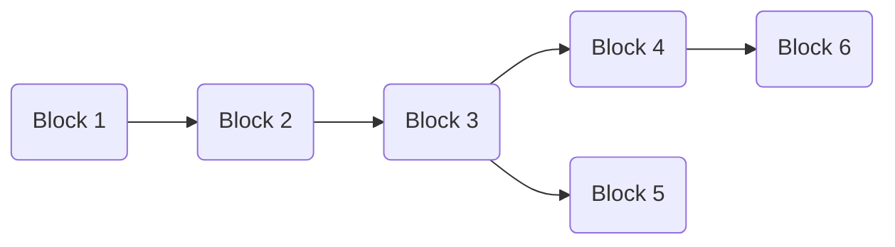

# Consensus Tree data structure

This is an outline of the consensus tree data structure used to track the current state of the
chain and all potentially viable forks.

## Data structure

The ConsensusTree will store blocks in a tree structure.  It is not a DAG because a block, even
with the same content as another, in a different part of the tree has different parents and hence
a different hash.

Only 'volatile' blocks (those within 'k' blocks of the current longest chain tip) are stored.



Blocks should be identified by hash.

The content of each Block comprises:

* The block number (height)
* The raw block body (`Option<Vec<u8>>` - None if not yet fetched)
* Pointers to child blocks (`Vec<Arc<Block>>`)
* Pointer to parent block (`Option<Arc<Block>>`) - the genesis root has none

These should be stored in a `HashMap<Hash, Arc<Block>>` for fast lookup by hash.

For the `get_favoured_chain()` operation we will probably need a
root_hash indicating the root of the tree, or a direct `Arc<Block>`
pointer, although it can be obtained from any node by walking
backwards up the tree.

## Observers

The ConsensusTree will need observers/callbacks for:

* `block_proposed`: Block proposed as new tip of favoured chain (connects to `cardano.block.proposed`)
* `rollback`: Favoured chain has switched - indicates rollback to the common ancestor block number

## Operations

### Check if a block is wanted

`check_block_wanted(hash: Hash, parent_hash: Hash, number: u64) -> Result<Vec<Hash>>`

Queried when the Peer Network Interface (PNI) has offered a new block.  Returns a list of blocks
that are now wanted, which may include both the one offered and any previously unfetched blocks
on the now favoured chain.

Operation: Find the parent block by hash in the hashmap.  If the
block's number is not one more than the parent's block number, reject
(return error)

Create an empty result vector.

Create a new block (with no block_body) and add the block to the tree by connecting to the
parent and adding it to the parent's children.  Call `get_favoured_chain()`.

If the favoured chain has switched, call `find_common_ancestor`
with the old and new favoured tips, and call the `rollback` observer with the resulting common
ancestor number.

If the new block is the favoured chain tip, add its hash to the result vector, and walk down
the chain from the common ancestor to the new tip.  For each block:

* If it is already fetched, call the `block_proposed` observer with it
* If not, add it to the result vector.

(it may be easier to recurse back up the chain from the tip and do this operation on exit from
each recursion)

The effect of this is to publish blocks on the new chain that we have, and request those
we don't, which will then be fixed up in `add_block()` when they arrive.

Call `prune(block.number)` to remove any now-immutable blocks.

### Add a block:

`add_block(block_body: Vec<u8>) -> Result<()>`

Called when PNI sends a block on `cardano.block.available`.

Operation: On receipt of a new candidate block, decode it to get the hash and look it up
in the hashmap.  If it's not there, fail (we shouldn't be sent blocks we haven't requested).

If this block was already fetched, exit.

Set the block_body of this block in the tree.

Call `get_favoured_chain` to get the favoured chain tip.

If all previous blocks from this block back to the root are fetched,
we are the next in order to be proposed, so call `block_proposed` with
this one, and any subsequent children which are on the favoured chain
(using `chain_contains()` with the favoured tip) which are also
fetched, stopping at any unfetched ones.

Note this is an event triggered fixup operation - each time a block arrives, we
propose as far down the chain as we can to retain the ordering.

### Remove a block

`remove_block(hash: Hash) -> Vec<Hash>`

Called when PNI sends `cardano.block.rescinded` because all peers have rolled back this block.
Returns a list of block hashes that have become wanted if the deletion of the block has changed the
favoured chain.

Find the block in the hash map, and remove it and all child blocks from the chain.

Process the potential favoured chain switch in the same way as `check_block_wanted()` (likely
common code), so that we generate a list of blocks that were previously unfetched but we now
need as part of the favoured chain, and propose any we have already fetched.

## Helper functions

### Get favoured chain

`get_favoured_chain() -> Arc<Block>`

Recursively search the tree from the root to find the longest chain, and return the
last block on the longest chain.  Uses an internal recursive function along these lines:

```rust
get_longest_chain_length_and_tip_from(block: Arc<Block>) -> (u64, Arc<Block>) {
  let mut max_length = 1;
  let mut tip = block;

  for child in block.children.iter() {
    let (child_max_length, child_tip) = get_longest_chain_length_and_tip_from(child);
    if child_max_length > max_length {
        max_length = child_max_length;
        tip = child_tip;
    }
  }

  (max_length, tip)
}
```

### Find common ancestor

`find_common_ancestor(a: Arc<Block>, b: Arc<Block>) -> Option<Arc<Block>>`

(actually this should never fail in any connected tree)

Something like...

1. Whichever of a & b has the highest number, or arbitrarily if the same, walk back up the chain from there until a branch point (a block with more than 1 child)
2. If a & b are the same, return Ok(a)
3. If both a & b have no parents, return None
4. Repeat from 1

### Chain contains

`chain_contains(block: Arc<Block>, tip: Arc<Block>) -> bool`

Returns whether a chain ending at the given tip includes the given block.  Walk back up
from the tip until you reach either the block (true) or there is no further to walk (false)

### Prune

`prune(latest_number: u64, favoured_tip: Arc<Block>)`

Discard all blocks from the tree older than `latest_number - k` where
'k' is the security parameter (a configuration option on the tree, currently 2160).  If discarded
blocks have multiple children, use `chain_contains` with each child and the `favoured_tip` to
see if each child branch is on the favoured chain, and recursively delete any that aren't.

