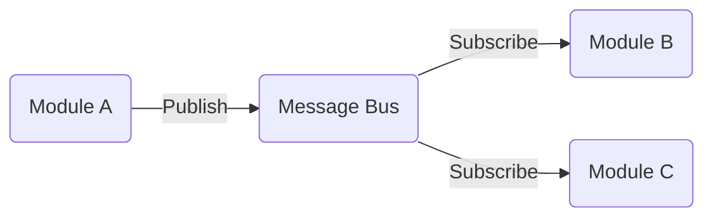
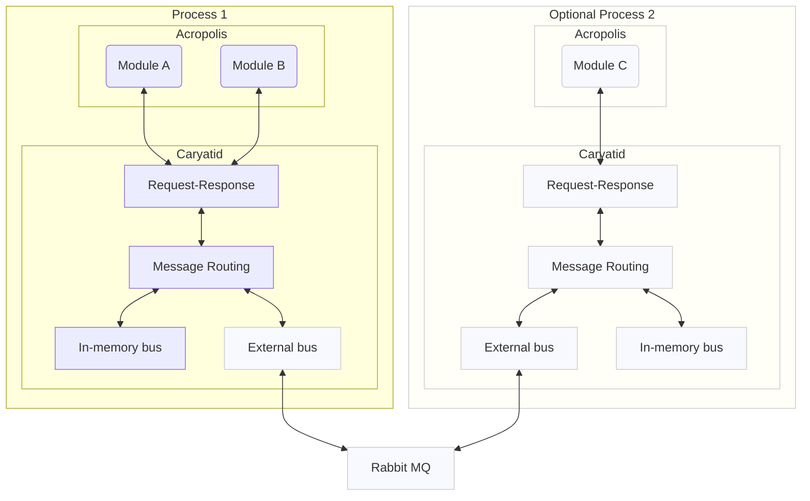
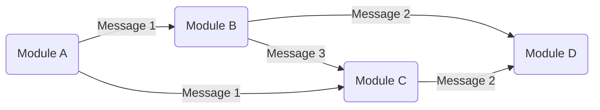

# The Modularity of Acropolis

Acropolis is a modular architecture for building nodes, indexers and
other clients for the Cardano blockchain, and maybe other blockchains
in the future.  Compared to other node implementations, it is this
modularity that is its defining feature - but what do we mean by this?

## Defining modularity

In some sense, any well-written software is modular; it may be
comprised of functions or classes, and these may be grouped together
in libraries.  With use of interfaces or traits, you can make it
somewhat 'pluggable', allowing different implementations to be
switched in.

The modularity we talk about in Acropolis, though, is a level above
this, and comes from the world of audio-visual processing,
synthesisers, vehicle, marine and aircraft electronics, and enterprise
back-office systems.  These might seem widely different fields, but
they share a common philosophy - systems are composed of modules which
do a defined job with defined inputs and outputs, but have no
knowledge of each other - any dependencies between them are only
created when they are configured or plugged together.

The communication between the modules is done through messages, rather
than conventional function or method calls.  In a modular synthesiser,
this 'message' may just be the voltage on a wire; in marine
electronics a 'sentence' on a serial bus; in enterprise software, a
JSON document.  In each case they are not usually requests for
something to happen but a statement of some fact - a key has been
pressed, the speed is 4.6 knots, an order has been placed...

## Publish-subscribe

In software, you can directly connect modules together (this is usual
in video pipelines, for example), but in enterprise software - and
also modular electronics - it's usual to use some kind of broadcast
mechanism to remove any dependency between modules.  Sending every message
to every module works fine for ship data, but in software architecture the
distribution is usually mediated with a "publish-subscribe" (pub-sub) bus,
where messages are sent on certain 'topics' (subjects) and modules subscribe
only for the topics that they are interested in.

## The benefits

This philosophy has a number of benefits:

1. Modules can be developed and tested in isolation
2. Modules can be replaced, added or removed without affecting others
3. All the communication between modules can be traced and diagnosed
4. The system can easily be extended, specialised or upgraded without
   any involvement of the original development team
5. The system naturally runs in parallel - each module can run
   independently, and can be horizontally scaled - you can have
   multiple modules doing the same work.

## The costs

Of course, this flexibility comes at some potential cost:

1. The cost of creating, sending, receiving and reading the messages,
   instead of a simple function call
2. The code complexity of publishing and subscribing to a message bus
3. Some actions - API queries, for example - genuinely are
   request-response based, and handling that on a pub-sub bus can be
   complex

Mitigating these costs is why we have the [Caryatid](https://github.com/input-output-hk/caryatid)
framework that Acropolis is built on.

The cost of message passing only happens if you need to serialise and deserialise messages
to pass them between processes over an external bus.  Although this mode is possible in Caryatid -
to add third-party extensions, for example - its default mode is combining all the modules into
a single process and using in-memory message passing of native data (Rust structs), avoiding all
that overhead.

Caryatid also provides simple subscription and publication functions, abstracting away the
complexity of the message bus, and making it almost as simple as a function definition or call.

Finally, Caryatid provides a request-response layer over the raw message bus, which makes it as
easy to send or handle a request as it would be in any RPC system.

## Simplification for design

When we talk about the design of Acropolis and how all the modules interact, we gloss over
the publish-subscribe message flow and message bus, and draw and describe the system as if
the modules talked directly to each other.  For many message flows in a realistic system they
are actually one publisher and one subscriber anyway.  In some cases - the transaction certificates
output by TxUnpacker is a good example - it is one publisher and many subscribers.  There can be
multiple publishers on the same topic, too - for example a number of different sources publish
blocks to be proceesed.

A simple graph diagram covers all these cases:

and this is how we describe the system in these pages.
