# System description - starting from basics

We'll describe how all the modules in Acropolis fit together by building up the full node in
stages, which more-or-less reflects how it was developed.

To start with, let's create the simplest possible UTXO indexer, booting from genesis (the very
start of the Cardano chain) and using a Mithril block data dump to save fetching from the live
network.  Once we've processed all the Mithril data, we hand over to a block fetcher which then
synchronises with a friendly local relay node.

Here is the [configuration](../../processes/omnibus/configs/omnibus-basic-utxo.toml) for this setup.

## Module graph

```mermaid
flowchart LR
  GEN(Genesis Bootstrapper)
  MSF(Mithril Snapshot Fetcher)
  PNI(Peer Network Interface)
  BU(Block Unpacker)
  TXU(Tx Unpacker)
  UTXO(UTXO State)

  GEN -- cardano.sequence.bootstrapped --> MSF
  MSF -- cardano.block.available --> BU
  MSF -- cardano.snapshot.complete --> PNI
  PNI -- cardano.block.available --> BU
  BU  -- cardano.txs --> TXU
  TXU -- cardano.utxo.deltas --> UTXO
  GEN -- cardano.utxo.deltas --> UTXO

  click GEN "https://github.com/input-output-hk/acropolis/tree/main/modules/genesis_bootstrapper/"
  click MSF "https://github.com/input-output-hk/acropolis/tree/main/modules/mithril_snapshot_fetcher/"
  click PNI "https://github.com/input-output-hk/acropolis/tree/main/modules/peer_network_interface/"
  click BU "https://github.com/input-output-hk/acropolis/tree/main/modules/block_unpacker/"
  click TXU "https://github.com/input-output-hk/acropolis/tree/main/modules/tx_unpacker/"
  click UTXO "https://github.com/input-output-hk/acropolis/tree/main/modules/utxo_state/"
```

## Data flow

The process starts with the [Genesis Bootstrapper](../../modules/genesis_bootstrapper)
reading the genesis data file, which was used to initialise the Cardano mainnet chain back
in 2017.  At this stage, all we're interested in are the "Genesis
UTXOs" - these are the initial distribution of Ada based on the
purchases from the pre-launch "vending machine" (AVVM) process.  It
sends these as a `cardano.utxo.deltas` message to the UTXOState
(remembering we are describing this with a gods' eye view of who
subscribes to that topic - the Genesis Bootstrapper doesn't know or care who is listening).
It then sends a `cardano.sequence.bootstrapped` which triggers the next stage.

This is picked up by the [Mithril Snapshot Fetcher](../../modules/mithril_snapshot_fetcher),
which downloads a 'snapshot' containing the entire block history of the chain (up to a few hours
ago), if it doesn't already have a sufficiently recent one.  You can configure what 'sufficiently
recent' is in its section in the config file.

When it has downloaded the snapshot (about 50GB at the time of writing), verified and unpacked it,
it starts sending `cardano.block.available` messages with the raw data for every block in the
history.  When it's finished it sends a `cardano.snapshot.complete` message, which hands over
to the live synchronisation, as we'll see later.

The [Block Unpacker](../../modules/block_unpacker) receives the
`cardano.block.available` messages and, as its name suggests, decodes
the raw data and unpacks it into individual transactions.  It then
constructs and sends a `cardano.txs` message containing the raw data
for all the transactions in the block.  Note it sends a *single*
message for each block, containing a batch of transactions - this is
the standard pattern in Acropolis, and both improves performance by
reducing the number of messages processed and is also key to
[synchronisation](synchronisation.md) across topics.

The `cardano.txs` message is picked up by the [Tx Unpacker](../../modules/tx_unpacker) which
decodes each transaction and outputs messages for all the many things that can be contained
in one.  In this simple system we will only ask it to extract UTXO changes, or *deltas* - either
inputs, which spend an existing UTXO, or outputs, which create a new one.  It will send these
on `cardano.utxo.deltas`.

The final stage of our simple pipeline is the [UTXO State](../../modules/utxo_state), which
receives the UTXO deltas and applies them to its internal store of UTXOs, removing those that
are spent by inputs, and adding those that are created by outputs.  UTXO State has a number of
options for storage - we'll use the fast, in-memory one by default, which keeps all the UTXO data in
memory, at a cost of around 5GB at the current epoch (575).

In this simple system, all this does is record the UTXOs, count them,
and flag any errors (which we don't expect to see in mainnet, of
course!).  Naturally any real system would have more modules doing useful things with
this data, and/or providing APIs to read it, as we'll see as we expand our setup.

As already mentioned, when the Mithril Snapshot Fetcher has come to the end of the block data
in the snapshot, it sends a `cardano.sequence.bootstrapped` message indicating how far it got.
This is then picked up by the [Peer Network Interface](../../modules/peer_network_interface) which
is configured to be a block fetching client to one or more relays (the config has some standard
ones by default), and continues where the snapshot left off, fetching blocks from the live
network and publishing them as `cardano.block.available` in the same way.  Notice that the
Block Unpacker doesn't care where the blocks come from, as long as they are in sequence, which
the hand-off process ensures.
