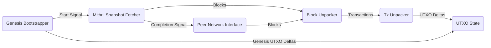

# System description - starting from basics

We'll describe how all the modules in Acropolis fit together by building up the full node in
stages, which more-or-less reflects how it was developed.

To start with, let's create the simplest possible UTXO indexer, booting from genesis (the very
start of the Cardano chain) and using a Mithril block data dump to save fetching from the live
network.  Once we've processed all the Mithril data, we hand over to a block fetcher which then
synchronises with a friendly local relay node.

## Module graph

