# System description - bootstrap and sync with basic ledger

Previously we created a [simple UTXO follower with live sync](system-simple-mithril-and-sync-utxo.md)
which only tracked UTXOs.  Now we want to add a more complete ledger, with tracking of
Stake Pool Operators (SPOs), delegation, rewards, reserves and treasury.

For this we need to add some more modules:

* [SPO State](../../modules/spo_state) which tracks SPO registration and retirement
* [Epochs State](../../modules/epochs_state) which counts blocks and fees for each epoch
* [Accounts State](../../modules/accounts_state) which tracks stake address balances, SPO delegation, monetary and reward accounts
* [Stake Delta Filter](../../modules/stake_delta_filter) which handles stake pointer addresses

## Module graph

```mermaid
flowchart LR
  GEN(Genesis Bootstrapper)
  MSF(Mithril Snapshot Fetcher)
  PNI(Peer Network Interface)
  BU(Block Unpacker)
  TXU(Tx Unpacker)
  UTXO(UTXO State)
  SPO(SPO State)
  ES(Epochs State)
  AC(Accounts State)
  SDF(Stake Delta Filter)

  GEN -- cardano.sequence.bootstrapped --> MSF
  MSF -- cardano.block.available --> BU
  MSF -- cardano.snapshot.complete --> PNI
  PNI -- cardano.block.available --> BU
  BU  -- cardano.txs --> TXU
  TXU -- cardano.utxo.deltas --> UTXO
  GEN -- cardano.utxo.deltas --> UTXO
  UTXO -- cardano.address.delta --> SDF
  SDF  -- cardano.stake.deltas --> AC
  TXU  -- cardano.certificates --> SDF
  TXU  -- cardano.certificates --> SPO
  TXU  -- cardano.certificates --> AC
  TXU  -- cardano.withdrawals --> AC
  SPO  -- cardano.spo.state --> AC
  GEN  -- cardano.pot.deltas --> AC
  TXU  -- cardano.block.txs --> ES
  ES   -- cardano.epoch.activity --> AC

  click GEN "https://github.com/input-output-hk/acropolis/tree/main/modules/genesis_bootstrapper/"
  click MSF "https://github.com/input-output-hk/acropolis/tree/main/modules/mithril_snapshot_fetcher/"
  click PNI "https://github.com/input-output-hk/acropolis/tree/main/modules/peer_network_interface/"
  click BU "https://github.com/input-output-hk/acropolis/tree/main/modules/block_unpacker/"
  click TXU "https://github.com/input-output-hk/acropolis/tree/main/modules/tx_unpacker/"
  click UTXO "https://github.com/input-output-hk/acropolis/tree/main/modules/utxo_state/"
  click SPO "https://github.com/input-output-hk/acropolis/tree/main/modules/spo_state/"
  click ES "https://github.com/input-output-hk/acropolis/tree/main/modules/epochs_state/"
  click AC "https://github.com/input-output-hk/acropolis/tree/main/modules/accounts_state/"
  click SDF "https://github.com/input-output-hk/acropolis/tree/main/modules/stake_delta_filter/"

  classDef NEW fill:#efe
  class SPO NEW
  class ES NEW
  class AC NEW
  class SDF NEW
```



## Data flow

The process bootstraps from Mithril, then syncs from the live chain and tracks UTXOs exactly
as [before](system-simple-mithril-and-sync-utxo.md).

TODO describe new flows

## Configuration

Here is the [configuration](../../processes/omnibus/configs/simple-mithril-and-sync-utxo.toml)
for this setup. You can run it in the `processes/omnibus` directory with:

```shell
$ cargo run --release -- --config configs/simple-mithril-and-sync-utxo.toml
```
