# System description - bootstrap and sync with Conway ledger

In the [previous setup](system-bootstrap-and-sync-with-basic-ledger.md) we tracked the ledger
state for the Shelley and subsequent eras, up to (but not including) Conway.

To move into Conway, we need to handle a much more complex governance system (CIP-1694).  The
[Parameters State](../../modules/parameters_state) and
[Governance State](../../modules/governance_state) we already have will handle Conway as well, but
we need to add one more:

* [DRep State](../../modules/drep_state) which tracks "Delegated Representatives" (DReps)

## Module graph

```mermaid
flowchart LR
  GEN(Genesis Bootstrapper)
  MSF(Mithril Snapshot Fetcher)
  PNI(Peer Network Interface)
  BU(Block Unpacker)
  TXU(Tx Unpacker)
  UTXO(UTXO State)
  SPO(SPO State)
  DREP(DRep State)
  ES(Epochs State)
  SDF(Stake Delta Filter)
  PARAM(Parameters State)
  GOV(Governance State)
  AC(Accounts State)

  GEN -- cardano.sequence.bootstrapped --> MSF
  MSF -- cardano.block.available --> BU
  MSF -- cardano.snapshot.complete --> PNI
  PNI -- cardano.block.available --> BU
  BU  -- cardano.txs --> TXU
  TXU -- cardano.utxo.deltas --> UTXO
  GEN -- cardano.utxo.deltas --> UTXO
  UTXO -- cardano.address.delta --> SDF
  SDF  -- cardano.stake.deltas --> AC
  TXU  -- cardano.certificates --> SDF
  TXU  -- cardano.certificates --> SPO
  TXU  -- cardano.certificates --> DREP
  TXU  -- cardano.certificates --> AC
  TXU  -- cardano.withdrawals --> AC
  TXU  -- cardano.governance --> GOV
  SPO  SPO_AC@-- cardano.spo.state --> AC
  GEN  -- cardano.pot.deltas --> AC
  TXU  -- cardano.block.txs --> ES
  AC AC_GOV_DREP@-- cardano.drep.distribution --> GOV
  AC AC_GOV_SPO@-- cardano.spo.distribution --> GOV
  PARAM PARAM_GOV@-- cardano.protocol.parameters --> GOV
  PARAM PARAM_AC@-- cardano.protocol.parameters --> AC
  PARAM PARAM_DREP@-- cardano.protocol.paramters --> DREP
  GOV   GOV_PARAM@ -- cardano.enact.state --> PARAM
  ES   ES_AC@-- cardano.epoch.activity --> AC
  DREP DREP_AC@-- cardano.drep.state --> AC

  click GEN "https://github.com/input-output-hk/acropolis/tree/main/modules/genesis_bootstrapper/"
  click MSF "https://github.com/input-output-hk/acropolis/tree/main/modules/mithril_snapshot_fetcher/"
  click PNI "https://github.com/input-output-hk/acropolis/tree/main/modules/peer_network_interface/"
  click BU "https://github.com/input-output-hk/acropolis/tree/main/modules/block_unpacker/"
  click TXU "https://github.com/input-output-hk/acropolis/tree/main/modules/tx_unpacker/"
  click UTXO "https://github.com/input-output-hk/acropolis/tree/main/modules/utxo_state/"
  click SPO "https://github.com/input-output-hk/acropolis/tree/main/modules/spo_state/"
  click DREP "https://github.com/input-output-hk/acropolis/tree/main/modules/drep_state/"
  click ES "https://github.com/input-output-hk/acropolis/tree/main/modules/epochs_state/"
  click AC "https://github.com/input-output-hk/acropolis/tree/main/modules/accounts_state/"
  click SDF "https://github.com/input-output-hk/acropolis/tree/main/modules/stake_delta_filter/"
  click PARAM "https://github.com/input-output-hk/acropolis/tree/main/modules/parameters_state/"
  click GOV "https://github.com/input-output-hk/acropolis/tree/main/modules/governance_state/"

  classDef NEW fill:#efe
  class DREP NEW

  classDef EPOCH stroke:#008
  class SPO_AC EPOCH
  class ES_AC EPOCH
  class PARAM_GOV EPOCH
  class PARAM_AC EPOCH
  class GOV_PARAM EPOCH
  class DREP_AC EPOCH
  class AC_GOV_DREP EPOCH
  class AC_GOV_SPO EPOCH
  class PARAM_DREP EPOCH
```



## Data flow
The process bootstraps from Mithril, then syncs from the live chain and tracks ledger state
exactly as [before](system-bootstrap-and-sync-basic-ledger.md).  We are just adding support
for the Conway era governance here.

### DReps
The new concept that Conway introduces is that of the "Delegated Representative" or DRep.  These
are like MPs or members of Congress, in that they vote on governance proposals of behalf of those
they represent.  Instead of being elected for a particular area they gain their mandate by
Cardano stakeholders delegating to them, and wield voting power in proportion to their total
delegations.

DReps are tracked with a new [DRep State](../../modules/drep_state) module.  It subscribes to
`cardano.tx.certificates` produced by the [Tx Unpacker](../../modules/tx_unpacker), to watch
DRep registrations, updates and retirements and deregistrations (retirements).
It keeps an internal store of these and issues a complete
list of all active DReps and their details at the start of each epoch, on `cardano.drep.state`.

### Accounts State
The `cardano.drep.state` message is picked up by the
[Accounts State](../../modules/accounts_state) module.  It then watches DRep delegations
coming from the `cardano.tx.certificates` and builds a map of which DRep (if any) each
stake address delegates to.  This enables it to derive the "DRep Delegation Distribution" (DRDD)
which it publishes once per epoch on `cardano.drep.distribution`.

### Governance State
The [Governance State](../../modules/governance_state) module has much more heavy lifting to do
in the Conway era than it did before.  This is a [separate topic](TODO) but for now let's just
look at the message flow.

In Conway the Governance State still gets governance events from the Tx Unpacker on
`cardano.governance` as before, but they are now Conway events about new proposals and
votes cast.  To tally up all the votes across all the DReps requires knowing the total
stake delegated to each one, which it gets from the `cardano.drep.distribution` DRDD we just
mentioned.  SPOs also have votes, also relative to the stake delegated to them, and so
the Governance State also subscribes to the `cardano.spo.distribution` SPDD which we saw
generated last time.

As before, if any proposal is enacted during an epoch, it sends a `cardano.enact.state` message,
which is used to update the Parameter State, as well as being available for any external
observer who is interested in the governance process.

## Configuration
Here is the
[configuration](../../processes/omnibus/configs/bootstrap-and-sync-with-conway.toml)
for this setup. You can run it in the `processes/omnibus` directory with:

```shell
$ cargo run --release -- --config configs/bootstrap-and-sync-with-conway.toml
```

## Next steps
Now we have a complete picture of the ledger, we need a way to access the data!  Next
we'll add a [REST API and history storage](system-ledger-with-api-and-history.md).

