# System description - bootstrap and sync with Conway ledger

In the [previous setup](system-ledger-with-api-and-history.md) we tracked the ledger
state for the whole history of the chain, and provided a BlockFrost-compatible API and
historical stores to access it.

Up to now we have trusted the blocks coming from our Mithril snapshot and upstream network
peer(s) and just tracked the ledger state without validating anything.  Now, though, it's time
to stand on our own two feet and start validating things, as a first step towards becoming a
relay node or a wallet backend, where trustworthy peers are *not* assumed.

There are two levels of validation in Cardano:

* Phase 1: Checking block header signatures and VRF calculations, transaction correctness, UTxO
rules, vote validity and many more - essentially all the rules of the Cardano ledger *except*
actually running any smart contract scripts

* Phase 2: Executing smart contract (Plutus) scripts

To be a relay node, you only have to do Phase 1.  To be a wallet back end or a full block-producing
node, you need to do both.  For now, we'll just consider Phase 1 validation.

The API and history functionality we added last time can be considered a plane above the core
node operations, so we're going to leave it out as we continue.  In a relay it wouldn't be needed
anyway, but it would for a wallet backend, because the API *is* the backend.  Just assume it's
transparently there if needed.

We introduce the following new modules for Phase 1 validation:

* [Consensus](../../modules/consensus) - coordinates validation
* [Block KES Validator](../../modules/block_kes_validator) - checks KES signatures to ensure
a block was produced by the right registered SPO.
* [Block VRF Validator](../../modules/block_vrf_validator) - checks block VRF calculations to
ensure that SPO really had the right to produce a block at this slot

Other existing modules will take part in the validation as well, as we'll see.

## Module graph

```mermaid
flowchart LR
  GEN(Genesis Bootstrapper)
  MSF(Mithril Snapshot Fetcher)
  PNI(Peer Network Interface)
  BU(Block Unpacker)
  TXU(Tx Unpacker)
  UTXO(UTXO State)
  SPO(SPO State)
  DREP(DRep State)
  ES(Epochs State)
  SDF(Stake Delta Filter)
  PARAM(Parameters State)
  GOV(Governance State)
  AC(Accounts State)
  CON(Consensus)
  KES(Block KES Validator)
  VRF(Block VRF Validator)

  GEN -- cardano.sequence.bootstrapped --> MSF
  MSF -- cardano.block.available --> CON
  CON -- cardano.block.proposed --> BU
  MSF -- cardano.snapshot.complete --> PNI
  PNI -- cardano.block.available --> CON
  CON -- cardano.block.proposed --> BU
  CON -- cardano.block.proposed --> VRF
  CON -- cardano.block.proposed --> KES
  BU  -- cardano.txs --> TXU
  TXU -- cardano.utxo.deltas --> UTXO
  GEN -- cardano.utxo.deltas --> UTXO
  UTXO -- cardano.address.delta --> SDF
  SDF  -- cardano.stake.deltas --> AC
  TXU  -- cardano.certificates --> SDF
  TXU  -- cardano.certificates --> SPO
  TXU  -- cardano.certificates --> DREP
  TXU  -- cardano.certificates --> AC
  TXU  -- cardano.withdrawals --> AC
  TXU  -- cardano.governance --> GOV
  SPO  SPO_AC@-- cardano.spo.state --> AC
  GEN  -- cardano.pot.deltas --> AC
  TXU  -- cardano.block.txs --> ES
  AC AC_GOV_DREP@-- cardano.drep.distribution --> GOV
  AC AC_GOV_SPO@-- cardano.spo.distribution --> GOV
  PARAM PARAM_GOV@-- cardano.protocol.parameters --> GOV
  PARAM PARAM_AC@-- cardano.protocol.parameters --> AC
  PARAM PARAM_DREP@-- cardano.protocol.paramters --> DREP
  GOV   GOV_PARAM@ -- cardano.enact.state --> PARAM
  ES   ES_AC@-- cardano.epoch.activity --> AC
  DREP DREP_AC@-- cardano.drep.state --> AC
  KES -- cardano.validation.kes --> CON
  VRF -- cardano.validation.vrf --> CON

  click GEN "https://github.com/input-output-hk/acropolis/tree/main/modules/genesis_bootstrapper/"
  click MSF "https://github.com/input-output-hk/acropolis/tree/main/modules/mithril_snapshot_fetcher/"
  click PNI "https://github.com/input-output-hk/acropolis/tree/main/modules/peer_network_interface/"
  click BU "https://github.com/input-output-hk/acropolis/tree/main/modules/block_unpacker/"
  click TXU "https://github.com/input-output-hk/acropolis/tree/main/modules/tx_unpacker/"
  click UTXO "https://github.com/input-output-hk/acropolis/tree/main/modules/utxo_state/"
  click SPO "https://github.com/input-output-hk/acropolis/tree/main/modules/spo_state/"
  click DREP "https://github.com/input-output-hk/acropolis/tree/main/modules/drep_state/"
  click ES "https://github.com/input-output-hk/acropolis/tree/main/modules/epochs_state/"
  click AC "https://github.com/input-output-hk/acropolis/tree/main/modules/accounts_state/"
  click SDF "https://github.com/input-output-hk/acropolis/tree/main/modules/stake_delta_filter/"
  click PARAM "https://github.com/input-output-hk/acropolis/tree/main/modules/parameters_state/"
  click GOV "https://github.com/input-output-hk/acropolis/tree/main/modules/governance_state/"

  classDef NEW fill:#efe
  class DREP NEW

  classDef EPOCH stroke:#008
  class SPO_AC EPOCH
  class ES_AC EPOCH
  class PARAM_GOV EPOCH
  class PARAM_AC EPOCH
  class GOV_PARAM EPOCH
  class DREP_AC EPOCH
  class AC_GOV_DREP EPOCH
  class AC_GOV_SPO EPOCH
  class PARAM_DREP EPOCH
```



## Flight Control

In a fairly monolithic architecture like the Haskell node or Amaru,
validation is a matter of running a sequence of rules over a proposed
transaction, based on a single (although complex) ledger state, either
in-memory (Haskell) or in a database (Amaru).  In theory some rules
can be run in parallel, although it's not clear these nodes actually
do so.  Conceptually, though, it's a type of lazy-AND, with the first
failure rejecting the transaction.

In our [modular](modularity.md) (and potentially distributed) case,
though, each module is responsible for its own domain of expertise, and hence for applying
the rules that are relevant to that area - for example [UTXO State](../../modules/utxo_state)
is the only module that can check that a UTxO isn't already spent, while
[Governance State](../../modules/governance_state) is uniquely able to validate whether
votes are for valid proposals.

So we need a way for multiple modules to vote on the validity of a transaction, with any
one having a veto.  We'll need a central coordinator to request and then receive back the votes
and take the relevant action on success or failure.

To do this, we borrow from [NASA's Flight Control](https://www.youtube.com/watch?v=y8rNlFYRcgs).
When an action is to be taken, the Flight Director calls for Go / NoGo from each specialist desk
- Retro, Guidance, Surgeon - before proceeding to the next stage.  Although (thankfully) it rarely
happens, one would assume that any single "NoGo" would be enough to halt the process.

In our case our Flight Director is the new [Consensus](../../modules/consensus) module, and
the desk controllers are each downstream module that has validation rules to process.

## Data flow
The process bootstraps from Mithril, then syncs from the live chain and tracks ledger state
exactly as [before](system-bootstrap-and-sync-basic-ledger.md).

Now, however, we introduce a new [Consensus](../../modules/consensus) module which will interpose
itself into the flow of blocks from the Mithril Snapshot Fetcher and Peer Network Interface, and
then listen for Go / NoGo responses from downstream modules.

## New modules

We have now introduced the following new modules:

### Consensus
Consensus listens on `cardano.block.available` and sends out proposed
blocks on `cardano.block.proposed`.  Existing modules that subscribed
to `cardano.block.available` will now listen to
`cardano.block.proposed` instead (actually that is the default, we
have been overriding this so far).

Consensus sets the `Validate` bit in the `BlockIntent` before passing
it on, and then waits for No/NoGo responses from a configured list of
downstream modules - specifically a set of `cardano.validation.x` topics where `x` is
a shorthand for the module name (e.g. `cardano.validation.utxo`).

At this stage all it does is log any failures as
a test of the validation system - later it will implement the Ouroboros longest/densest chain rules
to decide among different candidate chains being offered by upstream peers, and trigger
[rollbacks](rollbacks.md) if it needs to change its mind.

### Block KES Validator

TODO

### Block VRF Validator

TODO

## Existing modules

TODO all validation topics from existing modules - add to graph too.

## Configuration
Here is the
[configuration](../../processes/omnibus/configs/ledger-validation.toml)
for this setup. You can run it in the `processes/omnibus` directory with:

```shell
$ cargo run --release -- --config configs/ledger-validation.toml
```

## Next steps
TODO


