# System description - full ledger with API and history

In the [previous setup](system-bootstrap-and-sync-with-conway.md) we tracked the whole ledger
state up to and including Conway.  But although we can confirm it is working through logs and
the built-in verifiers, it doesn't yet have any practical use, and isn't easy to test as a whole
system.

To rectify both these faults, we need to add an API to allow queries of the ledger state.
Cardano already has a well-established REST API to do this,
[BlockFrost](https://docs.blockfrost.io/) so we decided to implement this.

The BlockFrost API has query endpoints both for current ledger state and also historical
ledger state, so we need to add both new modules and functionality to existing ones to store
the historical state as we progress through the chain.

The new modules are:

* [REST Server](https://github.com/input-output-hk/caryatid/tree/main/modules/rest_server) Caryatid's standard REST server
* [BlockFrost REST](../../modules/rest_blockfrost) which provides the actual REST endpoints
* [Chain Store](../../modules/chain_store) which stores all blocks seen and provides access to
both whole blocks and individual transactions
* [SPDD State](../../modules/spdd_state) which captures and stores the Stake Pool Delegation Distribution (SPDD) at every epoch
* [DRDD State](../../modules/drdd_state) which captures and stores the DRep Delegation Distribution
(DRDD) likewise
* [Historical Accounts State](../../historical_accounts_state) which stores the history of events for stake addresses
* [Historical Epochs State](../../historical_epochs_state) which stores statistics for each epoch we pass thorugh

## Module graph

```mermaid
flowchart LR
  GEN(Genesis Bootstrapper)
  MSF(Mithril Snapshot Fetcher)
  PNI(Peer Network Interface)
  BU(Block Unpacker)
  TXU(Tx Unpacker)
  UTXO(UTXO State)
  SPO(SPO State)
  DREP(DRep State)
  ES(Epochs State)
  SDF(Stake Delta Filter)
  PARAM(Parameters State)
  GOV(Governance State)
  AC(Accounts State)
  REST(REST Server)
  BF(BlockFrost REST)
  CS(Chain Store)
  SPDD(SPDD State)
  DRDD(DRDD State)
  HAC(Historical Accounts State)
  HES(Historical Epochs State)

  GEN -- cardano.sequence.bootstrapped --> MSF
  MSF -- cardano.block.available --> BU
  MSF -- cardano.block.available --> CS
  MSF -- cardano.snapshot.complete --> PNI
  PNI -- cardano.block.available --> BU
  PNI -- cardano.block.available --> CS
  BU  -- cardano.txs --> TXU
  TXU -- cardano.utxo.deltas --> UTXO
  GEN -- cardano.utxo.deltas --> UTXO
  UTXO -- cardano.address.delta --> SDF
  SDF  -- cardano.stake.deltas --> AC
  TXU  -- cardano.certificates --> SDF
  TXU  -- cardano.certificates --> SPO
  TXU  -- cardano.certificates --> DREP
  TXU  -- cardano.certificates --> AC
  TXU  -- cardano.withdrawals --> AC
  TXU  -- cardano.governance --> GOV
  TXU  -- cardano.governance --> DREP
  SPO  SPO_AC@-- cardano.spo.state --> AC
  GEN  -- cardano.pot.deltas --> AC
  TXU  -- cardano.block.txs --> ES
  AC AC_GOV_DREP@-- cardano.drep.distribution --> GOV
  AC AC_GOV_SPO@-- cardano.spo.distribution --> GOV
  PARAM PARAM_GOV@-- cardano.protocol.parameters --> GOV
  PARAM PARAM_AC@-- cardano.protocol.parameters --> AC
  PARAM PARAM_DREP@-- cardano.protocol.parameters --> DREP
  PARAM PARAM_CS@-- cardano.protocol.parameters --> CS
  GOV   GOV_PARAM@ -- cardano.enact.state --> PARAM
  ES   ES_AC@-- cardano.epoch.activity --> AC
  DREP DREP_AC@-- cardano.drep.state --> AC
  REST REST_BF@-- rest.get.{multiple} --> BF
  REST REST_DRDD@-- rest.get.drdd --> DRDD
  BF BF_UTXO@-- cardano.query.utxos --> UTXO
  BF BF_SPO@ -- cardano.query.pools --> SPO
  BF BF_DREP@ -- cardano.query.dreps --> DREP
  BF BF_ES@-- cardano.query.epochs --> ES
  BF BF_PARAM@-- cardano.query.parameters --> PARAM
  BF BF_GOV@-- cardano.query.governance --> GOV
  BF BF_AC@-- cardano.query.accounts --> AC
  BF BF_CS_BLOCKS@-- cardano.query.blocks --> CS
  BF BF_CS_TX@-- cardano.query.transactions --> CS
  BF BF_SPDD@-- cardano.query.spdd --> SPDD
  BF BF_HAC@-- cardano.query.historical.accounts --> HAC
  BF BF_HES@-- cardano.query.historical.epochs --> HES

  click GEN "https://github.com/input-output-hk/acropolis/tree/main/modules/genesis_bootstrapper/"
  click MSF "https://github.com/input-output-hk/acropolis/tree/main/modules/mithril_snapshot_fetcher/"
  click PNI "https://github.com/input-output-hk/acropolis/tree/main/modules/peer_network_interface/"
  click BU "https://github.com/input-output-hk/acropolis/tree/main/modules/block_unpacker/"
  click TXU "https://github.com/input-output-hk/acropolis/tree/main/modules/tx_unpacker/"
  click UTXO "https://github.com/input-output-hk/acropolis/tree/main/modules/utxo_state/"
  click SPO "https://github.com/input-output-hk/acropolis/tree/main/modules/spo_state/"
  click DREP "https://github.com/input-output-hk/acropolis/tree/main/modules/drep_state/"
  click ES "https://github.com/input-output-hk/acropolis/tree/main/modules/epochs_state/"
  click AC "https://github.com/input-output-hk/acropolis/tree/main/modules/accounts_state/"
  click SDF "https://github.com/input-output-hk/acropolis/tree/main/modules/stake_delta_filter/"
  click PARAM "https://github.com/input-output-hk/acropolis/tree/main/modules/parameters_state/"
  click GOV "https://github.com/input-output-hk/acropolis/tree/main/modules/governance_state/"
  click REST "https://github.com/input-output-hk/caryatid/tree/main/modules/rest_server"
  click BF "https://github.com/input-output-hk/acropolis/tree/main/modules/rest_blockfrost/"
  click CS "https://github.com/input-output-hk/acropolis/tree/main/modules/chain_store/"
  click SPDD "https://github.com/input-output-hk/acropolis/tree/main/modules/spdd_state/"
  click DRDD "https://github.com/input-output-hk/acropolis/tree/main/modules/drdd_state/"
  click HAC "https://github.com/input-output-hk/acropolis/tree/main/modules/historical_accounts_state/"
  click HES "https://github.com/input-output-hk/acropolis/tree/main/modules/historical_epochs_state/"


  classDef NEW fill:#efe
  class REST NEW
  class BF NEW
  class CS NEW
  class SPDD NEW
  class DRDD NEW
  class HAC NEW
  class HES NEW

  classDef EPOCH stroke:#008
  class SPO_AC EPOCH
  class ES_AC EPOCH
  class PARAM_GOV EPOCH
  class PARAM_AC EPOCH
  class GOV_PARAM EPOCH
  class DREP_AC EPOCH
  class AC_GOV_DREP EPOCH
  class AC_GOV_SPO EPOCH
  class PARAM_DREP EPOCH
  class PARAM_CS EPOCH

  classDef REQ stroke:#800
  class REST_BF REQ
  class REST_DRDD REQ
  class BF_UTXO REQ
  class BF_SPO REQ
  class BF_DREP REQ
  class BF_ES REQ
  class BF_PARAM REQ
  class BF_GOV REQ
  class BF_AC REQ
  class BF_CS_BLOCKS REQ
  class BF_CS_TX REQ
  class BF_SPDD REQ
  class BF_HAC REQ
  class BF_HES REQ
```



Note the edges in red indicate request-responses.

## Data flow
The process bootstraps from Mithril, then syncs from the live chain and tracks ledger state
exactly as [before](system-bootstrap-and-sync-with-conway.md).

TODO

## TODO New modules

Note DRDD is a non-BF extension

## Configuration
Here is the
[configuration](../../processes/omnibus/configs/ledger-with-api-and-history.toml)
for this setup. You can run it in the `processes/omnibus` directory with:

```shell
$ cargo run --release -- --config configs/ledger-with-api-and-history.toml
```

## Next steps


