# System description - full ledger with API and history

In the [previous setup](system-bootstrap-and-sync-with-conway.md) we tracked the whole ledger
state up to and including Conway.  But although we can confirm it is working through logs and
the built-in verifiers, it doesn't yet have any practical use, and isn't easy to test as a whole
system.

To rectify both these faults, we need to add an API to allow queries of the ledger state.
Cardano already has a well-established REST API to do this,
[BlockFrost](https://docs.blockfrost.io/) so we decided to implement this.

The BlockFrost API has query endpoints both for current ledger state and also historical
ledger state, so we need to add both new modules and functionality to existing ones to store
the historical state as we progress through the chain.  Note that you can be selective - if
particular historical features aren't needed for your application, you can just leave those
modules or or disable the feature, saving memory, disk and processing time.

We also provide some custom APIs for things like SPDD and DRDD history, which BlockFrost
doesn't provide.

The new modules are:

* [REST Server](https://github.com/input-output-hk/caryatid/tree/main/modules/rest_server) Caryatid's standard REST server
* [BlockFrost REST](../../modules/rest_blockfrost) which provides the actual REST endpoints
* [Chain Store](../../modules/chain_store) which stores all blocks seen and provides access to
both whole blocks and individual transactions
* [Assets State](../../modules/assets_state) which captures information about Cardano Native Assets
* [Address State](../../modules/address_state) which captures all UTxOs for stake addresses
* [SPDD State](../../modules/spdd_state) which captures and stores the Stake Pool Delegation Distribution (SPDD) at every epoch
* [DRDD State](../../modules/drdd_state) which captures and stores the DRep Delegation Distribution
(DRDD) likewise
* [Historical Accounts State](../../historical_accounts_state) which stores the history of events for stake addresses
* [Historical Epochs State](../../historical_epochs_state) which stores statistics for each epoch we pass through

## Module graph

```mermaid
flowchart-elk LR
  GEN(Genesis Bootstrapper)
  MSF(Mithril Snapshot Fetcher)
  PNI(Peer Network Interface)
  BU(Block Unpacker)
  TXU(Tx Unpacker)
  UTXO(UTXO State)
  SPO(SPO State)
  DREP(DRep State)
  ES(Epochs State)
  SDF(Stake Delta Filter)
  PARAM(Parameters State)
  GOV(Governance State)
  AC(Accounts State)
  ASSET(Assets State)
  ADDR(Address State)
  REST(REST Server)
  BF(BlockFrost REST)
  CS(Chain Store)
  SPDD(SPDD State)
  DRDD(DRDD State)
  HAC(Historical Accounts State)
  HES(Historical Epochs State)

  GEN -- cardano.sequence.bootstrapped --> MSF
  MSF -- cardano.block.available --> BU
  MSF -- cardano.block.available --> CS
  MSF -- cardano.block.available --> HES
  MSF -- cardano.snapshot.complete --> PNI
  PNI -- cardano.block.available --> BU
  PNI -- cardano.block.available --> CS
  PNI -- cardano.block.available --> HES
  BU  -- cardano.txs --> TXU
  TXU -- cardano.utxo.deltas --> UTXO
  GEN -- cardano.utxo.deltas --> UTXO
  UTXO -- cardano.address.delta --> SDF
  SDF  -- cardano.stake.deltas --> AC
  SDF  -- cardano.stake.deltas --> HAC
  TXU  -- cardano.certificates --> SDF
  TXU  -- cardano.certificates --> SPO
  TXU  -- cardano.certificates --> DREP
  TXU  -- cardano.certificates --> AC
  TXU  -- cardano.certificates --> HAC
  TXU  -- cardano.withdrawals --> AC
  TXU  -- cardano.withdrawals --> HAC
  TXU  -- cardano.governance --> GOV
  TXU  -- cardano.governance --> DREP
  TXU  -- cardano.asset.deltas --> ASSET
  TXU  -- cardano.utxo.deltas --> ASSET
  SPO  SPO_AC@-- cardano.spo.state --> AC
  GEN  -- cardano.pot.deltas --> AC
  TXU  -- cardano.block.txs --> ES
  AC AC_GOV_DREP@-- cardano.drep.distribution --> GOV
  AC AC_GOV_SPO@-- cardano.spo.distribution --> GOV
  AC AC_SPDD@-- cardano.spo.distribution --> SPDD
  AC AC_DRDD@-- cardano.drep.distribution --> DRDD
  AC AC_HAC@-- cardano.stake.reward.deltas --> HAC
  AC -- cardano.address.deltas --> ADDR
  AC -- cardano.address.deltas --> ASSET
  PARAM PARAM_GOV@-- cardano.protocol.parameters --> GOV
  PARAM PARAM_AC@-- cardano.protocol.parameters --> AC
  PARAM PARAM_ADDR@-- cardano.protocol.parameters --> ADDR
  PARAM PARAM_DREP@-- cardano.protocol.parameters --> DREP
  PARAM PARAM_CS@-- cardano.protocol.parameters --> CS
  PARAM PARAM_HAC@-- cardano.protocol.parameters --> HAC
  PARAM PARAM_HES@-- cardano.protocol.parameters --> HES
  GOV   GOV_PARAM@ -- cardano.enact.state --> PARAM
  ES   ES_AC@-- cardano.epoch.activity --> AC
  ES   ES_HES@-- cardano.epoch.activity --> HES
  DREP DREP_AC@-- cardano.drep.state --> AC
  REST REST_BF@-- "rest.get.{multiple}" --> BF
  REST REST_SPDD@-- rest.get.spdd --> SPDD
  REST REST_DRDD@-- rest.get.drdd --> DRDD
  BF BF_UTXO@-- cardano.query.utxos --> UTXO
  BF BF_SPO@ -- cardano.query.pools --> SPO
  BF BF_DREP@ -- cardano.query.dreps --> DREP
  BF BF_ES@-- cardano.query.epochs --> ES
  BF BF_PARAM@-- cardano.query.parameters --> PARAM
  BF BF_GOV@-- cardano.query.governance --> GOV
  BF BF_AC@-- cardano.query.accounts --> AC
  BF BF_CS_BLOCKS@-- cardano.query.blocks --> CS
  BF BF_CS_TX@-- cardano.query.transactions --> CS
  BF BF_SPDD@-- cardano.query.spdd --> SPDD
  BF BF_HAC@-- cardano.query.historical.accounts --> HAC
  BF BF_HES@-- cardano.query.historical.epochs --> HES

  %% Additional flows to SPOState, hopefully to be removed
  TXU -- cardano.withdrawals --> SPO
  TXU -- cardano.governance --> SPO
  MSF -- cardano.block.available --> SPO
  PNI -- cardano.block.available --> SPO
  ES -- cardano.epoch.activity --> SPO
  AC -- cardano.spo.distribution --> SPO
  SPD -- cardano.stake.deltas --> SPO
  AC -- cardano.spo.rewards --> SPO
  AC -- cardano.stake.reward.deltas --> SPO
  %% ends

  click GEN "https://github.com/input-output-hk/acropolis/tree/main/modules/genesis_bootstrapper/"
  click MSF "https://github.com/input-output-hk/acropolis/tree/main/modules/mithril_snapshot_fetcher/"
  click PNI "https://github.com/input-output-hk/acropolis/tree/main/modules/peer_network_interface/"
  click BU "https://github.com/input-output-hk/acropolis/tree/main/modules/block_unpacker/"
  click TXU "https://github.com/input-output-hk/acropolis/tree/main/modules/tx_unpacker/"
  click UTXO "https://github.com/input-output-hk/acropolis/tree/main/modules/utxo_state/"
  click SPO "https://github.com/input-output-hk/acropolis/tree/main/modules/spo_state/"
  click DREP "https://github.com/input-output-hk/acropolis/tree/main/modules/drep_state/"
  click ES "https://github.com/input-output-hk/acropolis/tree/main/modules/epochs_state/"
  click AC "https://github.com/input-output-hk/acropolis/tree/main/modules/accounts_state/"
  click SDF "https://github.com/input-output-hk/acropolis/tree/main/modules/stake_delta_filter/"
  click PARAM "https://github.com/input-output-hk/acropolis/tree/main/modules/parameters_state/"
  click GOV "https://github.com/input-output-hk/acropolis/tree/main/modules/governance_state/"
  click REST "https://github.com/input-output-hk/caryatid/tree/main/modules/rest_server"
  click BF "https://github.com/input-output-hk/acropolis/tree/main/modules/rest_blockfrost/"
  click CS "https://github.com/input-output-hk/acropolis/tree/main/modules/chain_store/"
  click SPDD "https://github.com/input-output-hk/acropolis/tree/main/modules/spdd_state/"
  click DRDD "https://github.com/input-output-hk/acropolis/tree/main/modules/drdd_state/"
  click HAC "https://github.com/input-output-hk/acropolis/tree/main/modules/historical_accounts_state/"
  click HES "https://github.com/input-output-hk/acropolis/tree/main/modules/historical_epochs_state/"


  classDef NEW fill:#efe
  class REST NEW
  class BF NEW
  class CS NEW
  class SPDD NEW
  class DRDD NEW
  class HAC NEW
  class HES NEW

  classDef EPOCH stroke:#008
  class SPO_AC EPOCH
  class ES_AC EPOCH
  class ES_HES EPOCH
  class PARAM_GOV EPOCH
  class PARAM_AC EPOCH
  class PARAM_ADDR EPOCH
  class GOV_PARAM EPOCH
  class DREP_AC EPOCH
  class AC_GOV_DREP EPOCH
  class AC_GOV_SPO EPOCH
  class AC_SPDD EPOCH
  class AC_DRDD EPOCH
  class AC_HAC EPOCH
  class PARAM_DREP EPOCH
  class PARAM_CS EPOCH
  class PARAM_HAC EPOCH
  class PARAM_HES EPOCH

  classDef REQ stroke:#800
  class REST_BF REQ
  class REST_SPDD REQ
  class REST_DRDD REQ
  class BF_UTXO REQ
  class BF_SPO REQ
  class BF_DREP REQ
  class BF_ES REQ
  class BF_PARAM REQ
  class BF_GOV REQ
  class BF_AC REQ
  class BF_CS_BLOCKS REQ
  class BF_CS_TX REQ
  class BF_SPDD REQ
  class BF_HAC REQ
  class BF_HES REQ
```



Note the edges in red indicate request-responses.

## Data flow
The process bootstraps from Mithril, then syncs from the live chain
and tracks ledger state exactly as
[before](system-bootstrap-and-sync-with-conway.md).  However in this
system there are now new modules listening to the messages flowing
past and recording them for historical queries - the benefit of the
pub-sub architecture is we can drop these into the existing message
flow without changing anything. We also enable some historical state
storage in existing modules.

There is also a whole new set of `cardano.query.xxx` messages (shown in red in the
diagram).  These are request-response messages - Caryatid provides a sugar layer to
make it easy to register a 'handler' for these requests, which just returns a result like a
standard function.  You can also `request()` something and just `await` an async response like
any other async function.

## New modules

We have added quite a few new modules in this system:

### REST Server
The
[REST Server](https://github.com/input-output-hk/caryatid/tree/main/modules/rest_server),
which is a standard Caryatid module, provides a generic REST endpoint, and turns HTTP
requests into request-response messages on the Caryatid message bus.  So, for example
`GET /foo/bar` turns into a `rest.get.foo.bar` request.

### Blockfrost REST
The actual BlockFrost REST endpoints are provided by the
[Blockfrost REST](../../modules/rest_blockfrost) module.
This module has handlers for a variety of `rest.get.xxx` requests.  Requests are routed
to their corresponding handler, which queries data from the ledger state modules
(sometimes multiple, which it aggregates), and returns the corresponding REST response.

### Chain Store

The [Chain Store](../../modules/chain_store) receives blocks from the Mithril Snapshot Fetcher
and the Peer Network Interface (depending on the phase of the synchronisation) and stores them
on disk, using a [Fjall key-value store](https://docs.rs/fjall/latest/fjall/). It also stores
indexes that allows it to retrieve blocks by hash, slot, number or epoch-slot combination, and
transactions by hash.

It then provides handlers to allow querying blocks and transactions through
`cardano.query.blocks` and `cardano.query.transactions` requests.  We're just using the Chain
Store to provide the BlockFrost API for now, but we'll see [later](TODO) it will be used to
serve blocks to downstream peers, too.

### Address State

The [Address State](../../modules/address_state) module takes
`cardano.address.deltas` (deposits and spends) from the UTXO State and
stores them along with their accompanying transaction IDs, in a Fjall disk store.

It can then provide a `cardano.query.address` handler which provides the data for the
BlockFrost `/addresses` endpoint.

### Assets State

Up to now we have only tracked UTxOs for Cardano Native Assets (CNAs), not the minting/burning
process, because they aren't used internally in
a node's operations.  However, they are a major part of Cardano, and there is a BlockFrost API
for them, so we need a new module, [Assets State](../../modules/assets_state) which tracks them.

This receives `cardano.asset.deltas` from the Tx Unpacker, and tracks
the minting and burning of CNA tokens.  If it is configured to store
historical data as well (see the [module page](../../modules/assets_state)
for details, it also takes `cardano.utxo.deltas` and `cardano.address.deltas`
so that it can fully handle `cardano.query.assets` from the BlockFrost `/assets` endpoints.

### SPDD State

The new [SPDD State](../../modules/spdd_state) module takes the Stake
Pool Delegation Distribution (SPDD) generated each epoch by the
Accounts State and stores it for each epoch.  It then provides a
`cardano.query.spdd` handler for any future modules to retrieve this,
and also a direct REST query `rest.get.spdd` for a `GET /spdd?epoch=208` request.

### DRDD State

Similarly, the [DRDD State](../../modules/drdd_state) captures the DRep Delegation Distribution
(DRDD) from Accounts State and stores it for each epoch.  It then provides `cardano.query.drdd`
and a direct REST query `rest.get.drdd` (enabling `GET /drdd?epoch=600`) as well.

### Historical Accounts State

The new [Historical Accounts State](../../modules/historical_accounts_state) module stores
the complete history of every stake address, including payments made to and from its
addresses, its rewards paid, and registration and deregistration.  It does this by receiving
`cardano.stake.deltas` from the Stake Delta Filter, `cardano.certificates` and
`cardano.withdrawals` from the Tx Unpacker, `cardano.stake.reward.deltas` from the
Accounts State and `cardano.protocol.parameters` from Parameters State.

Because this is a very large data set, the module stores updates as a hierarchical
store in two sections:

1. A 'volatile' section, in memory, which covers the last 'k' (currently 2160)
blocks, to allow easy rewind of the history in the event of a rollback
2. An immutable section, on disk (using Fjall again) with the long term history which
cannot be rolled back.

At the end of each epoch, it moves the volatile updates into the immutable store.  Although 'k'
is unlikely ever to change, this is why it subscribes to `cardano.protocol.parameters`.

To further tune the amount of disk space used, the Historical Accounts State has a number
of configuration options enabling various parts of the history - see the
[module page](../../modules/historical_accounts_state) for details.

To allow the BlockFrost API to query its data, the module handles
`cardano.query.historical.accounts` which has numerous flavours according to the data
required.  The configuration options enable the relevant parts of this request surface as well.

### Historical Epoch State

The [Historical Epoch State](../../modules/historical_epoch_state) module stores the per-epoch
data captured in an EpochActivityMessage on `cardano.epoch.activity`, which includes all the
timing and block height information for the epoch, the total number of transactions, total outputs
and fees, the number of blocks produced by each SPO and the VRF nonce.

It also subscribes to `cardano.block.available` just to get informed of any rollbacks and to
spot the new epoch.

Like Historical Accounts State, although the data stored is much smaller, it uses the same
pattern of a hierarchical store with volatile data in memory, and immutable data on disk (Fjall)
and in the same way subscribes to `cardano.protocol.parameters` to track 'k'.

### Accounts State

The existing [Accounts State](../../modules/accounts_state) module provides a query handler for
`cardano.query.accounts` which enables a number of BlockFrost REST endpoints:

* `GetAccountInfo`: Gets the current balances and delegations for a stake address, for the
`/accounts` endpoint
* `GetPoolLiveStake`: Gets the total stake of a pool, for the `/pools` endpoint
* `GetPoolsLiveStakes`: Same, for multiple pools
* `GetPoolDelegators`: Gets the list of delegators to a pool, for `/pools`
* `GetDrepDelegators`: Gets the list of delegators to a DRep, for `/governance/dreps`
* `GetAccountsDrepDelegationMap`: Maps a list of stake addresses to their delegated DRep, as a
helper for DRep State (TODO: This isn't actually BF specific)
* `GetOptimalPoolSizing`: Returns the 'stake pool target num' parameter also also (which only
Accounts State knows) the total reserves supply, to enable the `/pools/extended` endpoint.
* `GetAccountsUtxoValuesMap`: Maps a list of stake address to their total UTxO values, for the
`/governance/dreps` endpoint
* `GetAccountsUtxoValuesSum`: Get the sum of all UTxOs for a set of stake addresses, for the
`/pools` endpoint
* `GetAccountsBalancesMap`: Maps a list of stake addresses to their total balances (UTxO values
+ rewards).  Not currently used
* `GetActiveStakes`: Gets the total active stake (UTxOs + rewards) for all delegators of all pools
in the latest snapshot ('mark').  Used in the `/epochs` endpoint
* `GetAccountBalancesSum`: Gets the total balances (UTxO values + rewards) for a list of stake
addresses. Used in the `/governance/dreps/` endpoint.
* `GetSPDDByEpoch`: Fetches the SPDD for a particular epoch (only if historical SPDD is enabled),
for the `/epochs` endpoint
* `GetSPDDByEpochAndPool`: Fetches the map of delegated stake addresses and amounts delegated for
a particular epoch (also only if historical SPDD enabled), also for the `/epochs` endpoint.

The historical SPDD storage is enabled through configuration - see the
[module page](../../modules/accounts_state) for details.

### UTXO State

The [UTXO State](../../modules/utxo_state) module provides a `cardano.query.utxos` handler
which allows the BlockFrost REST API to get address balances for the `/addresses` endpoint.

### SPO State

The [SPO State](../../modules/spo_state) module is extended to track a large number of existing
topics in order to generate its own record of the stake distribution which it can then capture
historically, in order to provide a `cardano.query.pools` handler for the BlockFrost `/pools`
endpoint.

*Note: this was probably an architectural mistake which will be rectified soon, so we won't
go into too many details yet*

### DRep State

The [DRep State](../../modules/drep_state) provides a `cardano.query.dreps` handler to expose
the data it holds about currently registered DReps for the `/governance/dreps` endpoint.

Optionally, it can also store historical data about DRep registrations, delegators and votes -
see the [module page](../../modules/drep_state) for details.

### Epochs State

The [Epochs State](../../modules/epochs_state) module also provides a query handler,
`cardano.query.epochs` for the current epoch data and counts of blocks minted by particular
pools.  Note it doesn't store any history - this is done by the new Historical Epochs State
described above.

### Parameters State

[Parameters State](../../modules/parameters_state) handles `cardano.query.parameters` to provide
the current protocol parameters set, which enables the `/epochs/latest/parameters` endpoint.

If so configured (see the [module page](../../modules/parameters_state) for details), it can
also store the history of parameters for every epoch in the past, to enable the
`/epochs/{number}/parameters` endpoint.

### Governance State

The existing [Governance State](../../modules/governance_state) provides a query handler on
`cardano.query.governance` to give access to the its store of proposals / governance actions.
This enables the BlockFrost `/governance/proposals` and `/governance/proposal/<id>` endpoints.

Governance State does not currently store the history of expired or ratified proposals.  A
future Historical Governance State module may do so.

## Configuration
Here is the
[configuration](../../processes/omnibus/configs/ledger-with-api-and-history.toml)
for this setup. You can run it in the `processes/omnibus` directory with:

```shell
$ cargo run --release -- --config configs/ledger-with-api-and-history.toml
```

## Next steps

In the next step, we'll simplify things again and remove the API and historical storage
while we look at [validation](system-ledger-validation.md).
