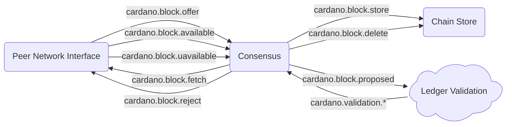

# System description - multi-peer consensus

[Previously](system-script-validation.md) we tracked the ledger
state for the whole history of the chain, with full validation.  The Consensus
module was informed of any validation failures, but since it was only tracking
a single upstream chain, it had nowhere else to go and could only log an error.

Now we want to implement consensus properly, fetching chain proposals from multiple
peers, choosing the best one and validating it.  If it turns out we've been fed
bad blocks, we need to roll back the ledger state and sanction the peer that gave
us it.  If the chain forks, we may find our preference for the best chain switches,
and we need to roll back to the branch point and replay the blocks on the newly
favoured chain to its current tip.

To do this we don't need to add any new modules, but we do need additional communication
paths and features in existing ones.

**This section is a proposed design, it does not exist yet (Jan 2026)**

## Module graph

We massive simplify the graph now to show just the consensus operation - the whole block unpacking,
ledger and validation infrastructure is just shown as a cloud.

## New functionality

We need to add the following new functionality and data flows to existing modules:

### Peer Network Interface
The [Peer Network Interface](../../modules/peer_network_interface) is already able to follow
multiple peers, but selects between them only if the initially selected one disconnects, not
on the basis of the quality of the chain being offered. We need to give this control to
Consensus.

To do this we insert consensus into the decision about which blocks to fetch.  The Peer
Network Interface will indicate that a block is being offered by a peer on `cardano.block.offer`,
quoting the block number, hash and previous block hash.  This allows Consensus to associate the
offer with a particular chain fork.

Consensus may then request that a block is fetched with
`cardano.block.fetch` quoting the block number and hash.  The Peer Network Interface will
then fetch it from one of the peers, chosen either round-robin or on performance metrics,
and send a `cardano.block.available` when it receives it, as it does already.  If no peer
can provide it, it sends a `cardano.block.unavailable` instead.

If the block provided turns out to be bad, Consensus may tell the Peer Network Interface with
a `cardano.block.reject` message, which allows it to sanction peers that provided it.  To do this
it needs a many-to-many map of block hashes to peers: multiple peers can provide the same block
and a single peer (of course) provides multiple blocks.

TODO: Automatic P2P discovery, "ledger peers" (from SPO state?)

### Consensus
The [Consensus](../../modules/consensus) module will need to maintain a tree of chain forks
being offered.  It doesn't need to know which peers offered them, that knowledge is kept within
Peer Network Interface.  On receipt of a `cardano.block.offer`
it can look up in the tree, which fork it applies to, based on the previous block hash,
and look at the block number to see if it is an extension of the existing chain or a rollback
creating a new fork.

Consensus will keep its own cache of blocks fetched (limited by 'k' depth), and request to fetch it
with a `cardano.block.fetch` message if it extends the currently favoured chain (see below)
and it doesn't already have it.  It should then get a `cardano.block.available` from the
Peer Network Interface, containing the block data.  If it gets a `cardano.block.unavailable` it will
prune the chain tree to remove it.

It sends it for validation with
`cardano.block.proposed` as we saw in the [Phase 1 Validation](system-ledger-validation.md) system.
If successful, it will be added to the chain tree, and sent to the Chain Store with a
`cardano.block.store` message for long term storage.  If it fails, it won't, and we will tell the
Peer Network Interface as above.

If the new block is on another fork, we don't fetch, validate or store it
yet, but add it marked as unvalidated to the relevant chain in the tree.

Each time a new block is offered, Consensus runs the Ouroboros chain selection rules to determine
the longest / densest chain (density is used when fast syncing - TBD).  This may result in the
favoured chain switching.  When this happens Consensus will signal a rollback and then reissue
blocks on the new favoured chain from the common branching point with the old one onwards, from
its in-memory block store, or fetching any it doesn't have (in most cases it won't have them,
unless the chain has flip-flopped).

The blocks of the new chain will be sent out to the Block Unpacker.  If the blocks
haven't already been validated, it will request validation;  if they have, there is no need.

If the blocks being replayed fail validation, that chain needs to be truncated, which will
probably (but not necessarily) mean it is no longer the favoured one.  As before we will tell
the Peer Network Interface which may sanction the peers that provide it.

After a chain switch, the blocks on the previously favoured chain need
to be deleted from the Chain Store with a `cardano.block.delete`
message.

Once the branch point of an unfavoured chain is more than 'k' blocks old, it can never be
selected, so Consensus can prune its tree.

### Chain Store

The [Chain Store](../../modules/chain_store) already provides persistent block storage for
the historical REST APIs.

The Chain Store will no longer accept every block on `cardano.block.available` but will wait for
Consensus to ask it to store one with `cardano.block.store`.  As noted above, it will also
provide cleanup with `cardano.block.delete`.

## Configuration
TODO

## Next steps
TODO

