# System description - phase 2 validation

In the [previous setup](system-ledger-validation.md) we tracked the ledger
state for the whole history of the chain, with 'Phase 1' validation where we checked
block headers, transaction signatures and ledger rules - everything *except* running
scripts.

Now we need to step up to full validation with scripts as well.

**This section is a proposed design, it does not exist yet (Jan 2026)**

## A brief background on scripts

In Cardano, scripts are the smart contract feature.  They are expressed in a byte-code
language called Plutus Core, which can be compiled from multiple surface languages:

* [Plinth / Plutus Tx](https://docs.cardano.org/developer-resources/smart-contracts/plutus) -
the original Haskell-like language
* [Aiken](https://aiken-lang.org/) - a Rust/ML like language
* [Marlowe](https://marlowe.iohk.io/) - a specialised DSL for financial contracts

A script is identified by the hash of its Plutus Core code.  The output of a transaction
(a UTxO) can be locked by a script hash rather than a payment address as is usually the case.
The transaction wanting to spend that UTxO then has to provide the script which matches
the hash, either inline in the transaction itself or with a reference to a previous UTxO
containing it.

### Script context

A script is essentially a function that returns True or False.  If it returns False, the
validation fails.  The inputs to the function - the *Script Context* - include:

* The contents of the spending transaction (inputs, outputs, certificates etc.)
* The 'purpose' (spending a UTxO, authorising a withdrawal etc.)
* The 'cost model' (see below)
* The datum of the output UTxO
* The 'redeemer' data of the spending input

The last two can be thought of as parameters to the function, one provided when the output
was locked, one provided by the attempt to unlock it.

### Script costs

Running a script has a *cost* associated with it, measured on two axes:

* CPU steps
* Memory units

The fee charged for a transaction is proportional to a budget on both axes.  There is a
*cost model* expressed in the protocol parameters which allows deterministic calculation of
the cost based on a certain input to the script.  Wallets and applications that produce
transactions can simulate this to make sure they attach the correct fee.

As a script runs, there is a monitor which checks the total costs incurred, and will abort
it if it goes over the budget expressed in the redeemer (which the fees must at least cover).

There is also a great deeper dive into scripts on the
[Aiken site](https://aiken-lang.org/fundamentals/eutxo).

## New modules

We introduce a single module for Phase 2 validation:

* [Script Runner (uplc-turbo)](../../modules/script_runner_uplc_turbo) - the actual script interpreter, PRAGMA 'uplc-turbo' version

The 'script runner' is split out so we have the option of easily replacing the interpreter without
needing to duplicate the script context logic.  Initially we intend to use the Pragma/Amaru fork
of the [uPLC interpreter](https://github.com/pragma-org/uplc) from the
[Aiken project](https://aiken-lang.org), but we want the option to use the
[original](https://github.com/aiken-lang/aiken/tree/main/crates/uplc) and/or
to bundle the Haskell [Plutus Core interpreter](https://github.com/IntersectMBO/plutus) as
an external microservice as well.

The majority of the work is done by new functionality in the [UTXO State](../../modules/utxo_state),
which stores scripts from UTxOs so they can be referenced later on and constructs the script
context to send to the Script Runner.

## Module graph

```mermaid
flowchart LR
  GEN(Genesis Bootstrapper)
  MSF(Mithril Snapshot Fetcher)
  PNI(Peer Network Interface)
  BU(Block Unpacker)
  TXU(Tx Unpacker)
  UTXO(UTXO State)
  SPO(SPO State)
  DREP(DRep State)
  ES(Epochs State)
  SDF(Stake Delta Filter)
  PARAM(Parameters State)
  GOV(Governance State)
  AC(Accounts State)
  CON(Consensus)
  KES(Block KES Validator)
  VRF(Block VRF Validator)
  SCRIPTR(Script Runner uplc-turbo)

  GEN -- cardano.sequence.bootstrapped --> MSF
  GEN -- cardano.sequence.bootstrapped --> KES
  GEN -- cardano.sequence.bootstrapped --> VRF
  MSF -- cardano.block.available --> CON
  CON -- cardano.block.proposed --> BU
  MSF -- cardano.snapshot.complete --> PNI
  PNI -- cardano.block.available --> CON
  CON -- cardano.block.proposed --> VRF
  CON -- cardano.block.proposed --> KES
  BU  -- cardano.txs --> TXU
  BU  -- cardano.txs --> SCRIPTV
  TXU -- cardano.utxo.deltas --> UTXO
  TXU -- cardano.utxo.scripts --> SCRIPTS
  GEN -- cardano.utxo.deltas --> UTXO
  UTXO -- cardano.address.delta --> SDF
  UTXO -- cardano.validation.utxo --> CON
  SDF  -- cardano.stake.deltas --> AC
  TXU  -- cardano.certificates --> SDF
  TXU  -- cardano.certificates --> SPO
  TXU  -- cardano.certificates --> DREP
  TXU  -- cardano.certificates --> AC
  TXU  -- cardano.withdrawals --> AC
  TXU  -- cardano.governance --> GOV
  SPO  SPO_AC@-- cardano.spo.state --> AC
  SPO  SPO_KES@-- cardano.spo.state --> KES
  SPO  SPO_VRF@-- cardano.spo.state --> VRF
  SPO  -- cardano.validation.spo --> CON
  GEN  -- cardano.pot.deltas --> AC
  TXU  -- cardano.block.txs --> ES
  AC AC_GOV_DREP@-- cardano.drep.distribution --> GOV
  AC AC_GOV_SPO@-- cardano.spo.distribution --> GOV
  AC AC_VRF@-- cardano.spo.distribution --> VRF
  AC -- cardano.validation.accounts --> CON
  PARAM PARAM_GOV@-- cardano.protocol.parameters --> GOV
  PARAM PARAM_AC@-- cardano.protocol.parameters --> AC
  PARAM PARAM_DREP@-- cardano.protocol.parameters --> DREP
  PARAM PARAM_KES@-- cardano.protocol.parameters --> KES
  PARAM PARAM_VRF@-- cardano.protocol.parameters --> VRF
  PARAM PARAM_UTXO@ -- cardano.protocol.parameters --> UTXO
  GOV   GOV_PARAM@ -- cardano.enact.state --> PARAM
  GOV -- cardano.validation.governance --> CON
  ES   ES_AC@-- cardano.epoch.activity --> AC
  ES   ES_VRF@-- cardano.epoch.nonce --> VRF
  DREP DREP_AC@-- cardano.drep.state --> AC
  KES -- cardano.validation.kes --> CON
  VRF -- cardano.validation.vrf --> CON
  UTXO UTXO_SCRIPTR@-- cardano.script.run --> SCRIPTR
  UTXO -- cardano.validation.script --> CON

  click GEN "https://github.com/input-output-hk/acropolis/tree/main/modules/genesis_bootstrapper/"
  click MSF "https://github.com/input-output-hk/acropolis/tree/main/modules/mithril_snapshot_fetcher/"
  click PNI "https://github.com/input-output-hk/acropolis/tree/main/modules/peer_network_interface/"
  click BU "https://github.com/input-output-hk/acropolis/tree/main/modules/block_unpacker/"
  click TXU "https://github.com/input-output-hk/acropolis/tree/main/modules/tx_unpacker/"
  click UTXO "https://github.com/input-output-hk/acropolis/tree/main/modules/utxo_state/"
  click SPO "https://github.com/input-output-hk/acropolis/tree/main/modules/spo_state/"
  click DREP "https://github.com/input-output-hk/acropolis/tree/main/modules/drep_state/"
  click ES "https://github.com/input-output-hk/acropolis/tree/main/modules/epochs_state/"
  click AC "https://github.com/input-output-hk/acropolis/tree/main/modules/accounts_state/"
  click SDF "https://github.com/input-output-hk/acropolis/tree/main/modules/stake_delta_filter/"
  click PARAM "https://github.com/input-output-hk/acropolis/tree/main/modules/parameters_state/"
  click GOV "https://github.com/input-output-hk/acropolis/tree/main/modules/governance_state/"
  click CON "https://github.com/input-output-hk/acropolis/tree/main/modules/consensus/"
  click VRF "https://github.com/input-output-hk/acropolis/tree/main/modules/block_vrf_validator/"
  click KES "https://github.com/input-output-hk/acropolis/tree/main/modules/block_kes_validator/"
  click SCRIPTR "https://github.com/input-output-hk/acropolis/tree/main/modules/script_runner_uplc_turbo/"

  classDef NEW fill:#efe
  class SCRIPTR NEW

  classDef EPOCH stroke:#008
  class SPO_AC EPOCH
  class SPO_KES EPOCH
  class SPO_VRF EPOCH
  class ES_AC EPOCH
  class ES_VRF EPOCH
  class PARAM_GOV EPOCH
  class PARAM_AC EPOCH
  class GOV_PARAM EPOCH
  class DREP_AC EPOCH
  class AC_GOV_DREP EPOCH
  class AC_GOV_SPO EPOCH
  class AC_VRF EPOCH
  class PARAM_DREP EPOCH
  class PARAM_KES EPOCH
  class PARAM_VRF EPOCH
  class PARAM_UTXO EPOCH

  classDef REQ stroke:#800
  class UTXO_SCRIPTR REQ
```

## New modules

We have introduced one new module:

### Script Runner

The [Script Runner uplc-turbo](../../modules/script_runner_uplc_turbo) is the raw script interpreter,
initially using the Pragma/Amaru [uplc-turbo](https://github.com/pragma-org/uplc) interpreter.
This is conceptually simple - it takes requests to run a script on `cardano.script.run`, which
includes the script and all the data required to run it, runs it, and returns a success or error
result.

In the future we may want to use other interpreters, including the option of wrapping the
Haskell Plutus Core interpreter in an external microservice.

## Extensions to existing modules

### UTXO State

The [UTXO State](../../modules/utxo_state) module will now store the scripts it sees in
transaction outputs, indexed by their hash.  This allows it to look up a reference script
quoted in the 'redeemer' part of an input.

It already has the rest of the information it needs to construct the script context - it can get
the relevant parts of the transaction from the UTXODelta message from the Tx Unpacker, and can
look up the datum of the UTxO being spent in its own UTxO store.  It also needs the current cost
model which it gets from protocol parameters on `cardano.protocol.parameters`.

Armed with all this information, it can then ask the Script Runner to run the script, passing
all the parameters in a `cardano.script.run` request.  The result is success or an error code,
which the UTXO State can turn into a `cardano.validation.script` validation result for
consensus.

## Configuration
TODO

## Next steps
Next we will add [multi-peer consensus](system-multi-peer-consensus.md) and chain selection.

