# System description - simple UTXO follower with live sync

Having created a [simple Mithril UTXO follower](system-simple-mithril-utxo.md) we'll now add
the ability to continue after the Mithril snapshot and follow the live chain, fetching data
from a trusted (for now) set of upstream nodes.

For this we just need to add one module, the
[Peer Network Interface](../../modules/peer_network_interface)
which just plugs into the existing graph:

## Module graph

```mermaid
flowchart LR
  GEN(Genesis Bootstrapper)
  MSF(Mithril Snapshot Fetcher)
  PNI(Peer Network Interface)
  BU(Block Unpacker)
  TXU(Tx Unpacker)
  UTXO(UTXO State)

  GEN -- cardano.sequence.bootstrapped --> MSF
  MSF -- cardano.block.available --> BU
  MSF -- cardano.snapshot.complete --> PNI
  PNI -- cardano.block.available --> BU
  BU  -- cardano.txs --> TXU
  TXU -- cardano.utxo.deltas --> UTXO
  GEN -- cardano.utxo.deltas --> UTXO

  click GEN "https://github.com/input-output-hk/acropolis/tree/main/modules/genesis_bootstrapper/"
  click MSF "https://github.com/input-output-hk/acropolis/tree/main/modules/mithril_snapshot_fetcher/"
  click PNI "https://github.com/input-output-hk/acropolis/tree/main/modules/peer_network_interface/"
  click BU "https://github.com/input-output-hk/acropolis/tree/main/modules/block_unpacker/"
  click TXU "https://github.com/input-output-hk/acropolis/tree/main/modules/tx_unpacker/"
  click UTXO "https://github.com/input-output-hk/acropolis/tree/main/modules/utxo_state/"

  classDef NEW fill:#efe
  class PNI NEW
```



## Data flow
The process follows exactly the same sequence as [before](system-simple-mithril-utxo.md) initially:

* [Genesis Bootstrapper](../../modules/genesis_bootstrapper) reads and sends the Genesis UTXOs
* [Mithril Snapshot Fetcher](../../modules/mithril_snapshot_fetcher) reads a block history snapshot and sends out the raw blocks
* [Block Unpacker](../../modules/block_unpacker) decodes the blocks into individual transactions
* [Tx Unpacker](../../modules/tx_unpacker) decodes transactions and produces UTXO deltas
* [UTXO State](../../modules/utxo_state) catches and checks the UTXO deltas and maintains a store of active ones.

To this we have added a [Peer Network Interface](../../modules/peer_network_interface), which
just slots into the existing graph.

When the Mithril Snapshot Fetcher has come to the end of the block data
in the snapshot, it sends a `cardano.snapshot.complete` message indicating how far it got (it
was already doing this but no-one was listening, so we didn't mention it before).

This is then picked up by the Peer Network Interface, which is
configured to be a block fetching client to one or more relays - the
config has some standard ones by default.  It continues where the
snapshot left off, fetching blocks from the live network and
publishing them as `cardano.block.available` in the same way.

Notice that we didn't have to reconfigure anything else - the Block Unpacker
doesn't care where the blocks come from, as long as they are in
sequence, which the hand-off process ensures.  This is the benefit of the pub-sub
architecture!

## Configuration
Here is the [configuration](../../processes/omnibus/configs/simple-mithril-and-sync-utxo.toml)
for this setup. You can run it in the `processes/omnibus` directory with:

```shell
$ cargo run --release -- --config configs/simple-mithril-and-sync-utxo.toml
```

## Next steps
To continue, we will add more complete
[ledger state tracking](system-bootstrap-and-sync-with-basic-ledger.md).
