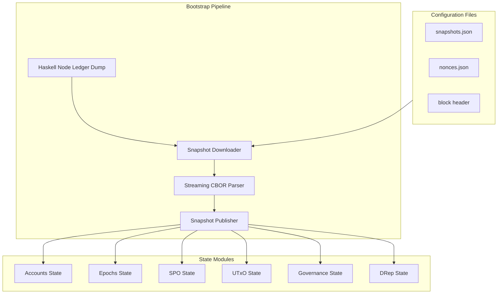
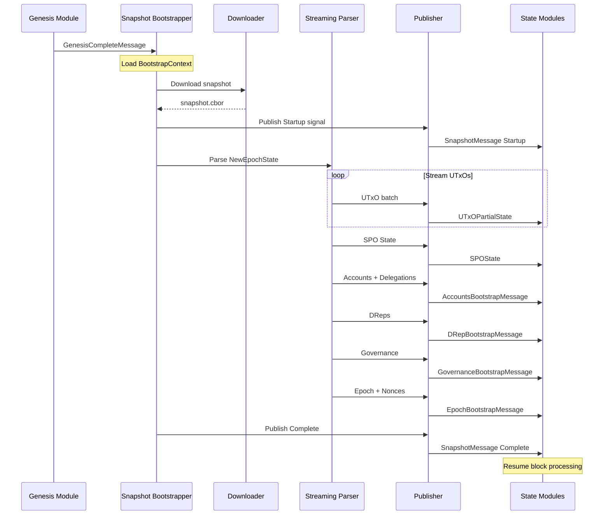
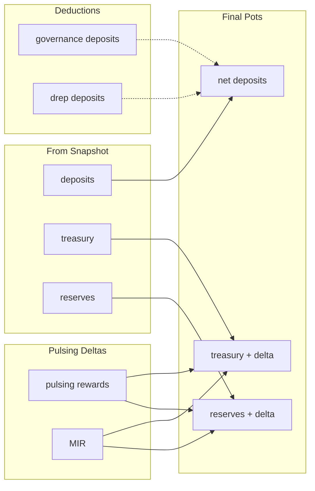

# Boot from Snapshot
## The Problem

Bootstrapping Acropolis from Genesis requires replaying the **entire blockchain history** to build up state. For
mainnet, this means processing millions of blocks - a process that takes hours and significantly slows down testing
cycles.

**Pain Points:**
- Slow bootstrap times (hours for full replay)
- Extended CI/CD cycles make testing correctness impractical

## The Solution

Instead of replaying from Genesis, we bootstrap directly from a **Haskell node ledger state snapshot** (NewEpochState CBOR dump). This allows the system to:

1. Download a compressed snapshot file
2. Stream-parse the CBOR to extract all required state
3. Publish state to a message bus
4. Each module initializes itself from the published data
5. Resume block processing from the snapshot point

It now takes minutes to get to a specific epoch, instead of hours.

---

## Quick Start

Run the omnibus with bootstrap configuration:

```bash
make run-bootstrap
```

This uses the `omnibus.bootstrap.toml` overlay config which sets `method = "snapshot"` and configures the snapshot bootstrapper.

### Configuration Files

The omnibus process supports multiple config files where later files override earlier ones:

| File | Purpose |
|------|---------|
| `omnibus.toml` | Base configuration with all module settings |
| `omnibus.bootstrap.toml` | Bootstrap overlay (snapshot method, snapshot settings) |

To run with custom config combinations:

```bash
cargo run -- --config omnibus.toml --config omnibus.bootstrap.toml
```

---

## Architecture Overview



---

## State Extracted from Snapshot

| State Component | Description |
|-----------------|-------------|
| **UTxO State** | All live UTxOs (streamed in 10K batches) |
| **SPO State** | Active stake pools with parameters + retiring pools |
| **Stake Registrations** | All registered stake addresses |
| **Stake Delegations** | Delegation mappings to SPOs |
| **Reward Balances** | All reward account balances |
| **Stake Snapshots** | Mark/Set/Go snapshots for reward calculation |
| **Pots** | Treasury, Reserves, Deposits |
| **Protocol Parameters** | Current epoch protocol parameters |
| **Reward Deltas** | Pending rewards to be paid at epoch boundary |
| **Epoch Activity** | Fees and block counts per SPO |
| **Governance** | Proposals, votes, committee, constitution |
| **DReps** | Delegated representatives and their delegators |

---

## Bootstrap Sequence



---

## Key Implementation Details

### Streaming Parser
- First 512MB buffered for metadata extraction
- UTxOs streamed one-by-one (not loaded into memory)
- Batched into 10,000 UTxO messages for efficiency

### Ordered Publishing
All state messages use `tokio::block_in_place()` to ensure:
- Messages published in exact order
- All bootstrap data sent before completion signal
- No race conditions between modules

### Pot Delta Handling



---

## Configuration

```toml
[bootstrap]
network = "mainnet"
data-dir = "/path/to/snapshot/data"
epoch = 507
snapshot-topic = "cardano.snapshot"
sync-command = "cardano.sync.command"

[bootstrap.download]
timeout_secs = 300
connect_timeout_secs = 30
```

### Required Files in data-dir
```
data/
  snapshots.json    # Manifest with URL, epoch, block point
  nonces.json       # Epoch nonces (active, evolving, candidate, tail)
  blocks/
    block.{slot}.{hash}.cbor   # Block header for snapshot point
```

---

## Benefits

| Before (Genesis) | After (Snapshot) |
|------------------|------------------|
| Hours to bootstrap | Minutes to bootstrap |
| Full history replay | Jump to target epoch |
| Heavy storage needs | Minimal state only |
| Slow CI/CD cycles | Fast verification tests |
| Can't verify rewards | Correct SPDD from snapshot |

---

## Future Work

- Canonical ledger state format (Tweag initiative)
- CI/CD integration for correctness testing
