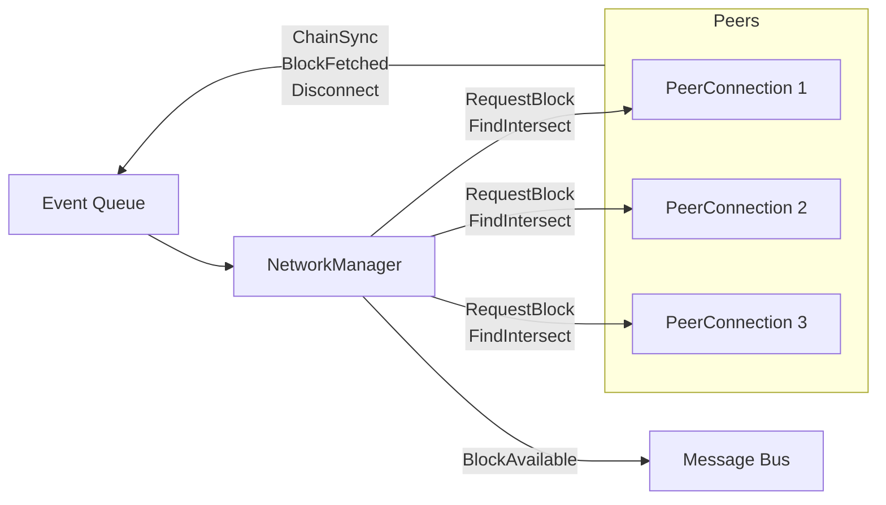

# Architecture

This module uses an event-queue-based architecture. A `NetworkManager` is responsible for creating a set of `PeerConnection`s and sending commands to them. Each `PeerConnection` maintains a connection to a single peer; it responds to commands from the `NetworkManager`, and emits events to an event queue. The `NetworkManager` reads from that queue to decide which chain to follow. When blocks from the preferred chain have been fetched, it publishes those blocks to the message bus.

This module requests the body for every block announced by any chain, from the first chain which announced it. When it has the body for the next block announced, it will publish it to the message bus.

