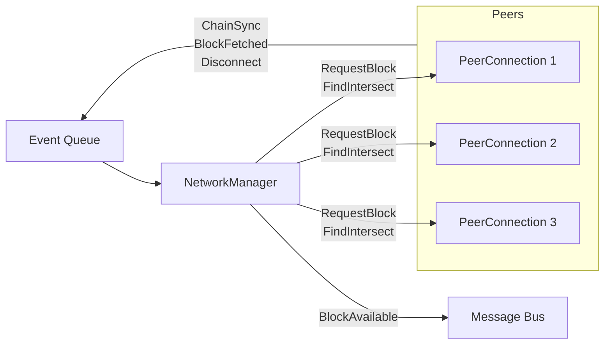

# Peer network interface module

The peer network interface module uses the ChainSync and BlockFetch protocols to fetch blocks from upstream sources,
that is, peers. The module supports multiple peers and uses PeerSharing mini-protocol for peer discovery and management.

Currently the module supports two modes of block management:

- `direct` - chooses one peer to treat as the "preferred" chain to follow, but will gracefully switch which peer it
  follows during network issues. Rollbacks are handled by signalling in the block data. If the chain reports a rollback
  (or if this module switches to a different chain), the next message it emits will be the new head of the chain and
  have the status `RolledBack`.
- `consensus` - follows the chain that the consensus protocol has agreed upon. In this mode it is the consensus module,
  which is responsible for signalling rollbacks. Keeps the forks in sync, performs blocks deduplication.

Peer sharing can be disabled by setting `peer-sharing-enabled` to `false`. By default this mode is enabled.

The peer network interface module can either run independently, from the origin or current tip, or be triggered by a
Mithril snapshot event (the default) where it starts from where the snapshot left off, and follows the chain from there.

## Configuration

See [./config.default.toml](./config.default.toml) for the available configuration options and their default values.

## Messages

This module publishes "raw block messages". Each message includes the raw bytes composing the header and body of a
block.

The peer network interface module in `consensus` mode publishes messages in `cardano.block.available`,
`cardano.block.offered` and `cardano.block.rescinded` topics. It subscribes to `cardano.block.wanted` and
`cardano.block.rejected` topics.

When the sync-point mode is set to `dynamic`, the module will subscribe for `cardano.sync.command` and wait for
`Command::ChainSync(ChainSyncCommand::FindIntersect(Point))`, which is how PNI is switching from Mithril to upstream
fetching.

## Architecture

This module uses an event-queue-based architecture. A `NetworkManager` is responsible for creating a set of
`PeerConnection`s and sending commands to them. Each `PeerConnection` maintains a connection to a single peer; it
responds to commands from the `NetworkManager`, and emits events to an event queue. The `NetworkManager` reads from that
queue to decide which chain to follow. When blocks from the preferred chain have been fetched, it publishes those blocks
to the message bus.

This module requests the body for every block announced by any chain, from the first chain which announced it. When it
has the body for the next block announced, it will publish it to the message bus.

